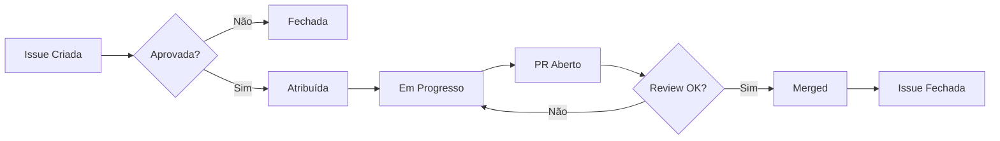

# 📋 Documentação de Issues e Milestones - VSmenu Docs

Este documento fornece uma visão geral das issues criadas para o repositório `vsmenu-docs` e serve como guia para criação de novas issues.

## 🎯 Resumo do Trabalho Realizado

### Issues Implementadas ✅

Até o momento, **5 de 6 issues** do MVP da documentação foram completadas:

| # | Issue | Prioridade | Status | Milestone |
|---|-------|-----------|--------|-----------|
| #8 | Setup GitHub Actions CI/CD | High | ✅ Completo | v0.1 |
| #9 | Deploy Automático (GitHub Pages) | High | ✅ Completo | v0.1 |
| #7 | Sistema de Busca Local | Medium | ✅ Completo | v0.1 |
| #5 | Tema e Branding VSmenu | Medium | ✅ Completo | v0.1 |
| #12 | Code of Conduct | Low | ✅ Completo | v0.1 |
| #2 | Documentar Issues e Milestones | High | 🔄 Em progresso | v0.1 |

### O que Foi Implementado

#### Issue #8 - GitHub Actions CI/CD ✅

**Arquivos criados:**

- `.github/workflows/ci.yml` - Workflow de CI (build, lint, check-links)
- `.github/workflows/deploy.yml` - Workflow de deploy para GitHub Pages
- `.github/workflows/pr-comment.yml` - Comentários automáticos em PRs
- `.markdownlint.json` - Configuração do linter de Markdown
- `.markdown-link-check.json` - Configuração do verificador de links

**Scripts adicionados ao package.json:**

```json
{
  "lint:md": "markdownlint '**/*.md' --ignore node_modules --ignore docs/.vitepress",
  "lint:md:fix": "markdownlint '**/*.md' --ignore node_modules --ignore docs/.vitepress --fix",
  "check-links": "markdown-link-check docs/**/*.md --config .markdown-link-check.json",
  "test": "npm run docs:build"
}
```

**Dependências adicionadas:**

- `markdown-link-check@^3.12.2`
- `markdownlint-cli@^0.42.0`

#### Issue #9 - Deploy Automático ✅

**Configurações realizadas:**

- Workflow de deploy configurado (`.github/workflows/deploy.yml`)
- Base URL configurado no VitePress (`base: '/vsmenu-docs/'`)
- Documentação de deployment criada (`DEPLOYMENT.md`)
- Badges de status adicionados ao README
- URL da documentação publicada: <https://vsmenu.github.io/vsmenu-docs/>

**Recursos:**

- Deploy automático ao fazer push na `main`
- Permissões configuradas (contents:read, pages:write, id-token:write)
- Build artifacts com retenção de 7 dias

#### Issue #7 - Sistema de Busca ✅

**Já estava implementado no config.ts:**

- Busca local configurada
- Traduções em português
- Atalhos de teclado (Ctrl+K / Cmd+K)
- Busca instantânea com preview de resultados

#### Issue #5 - Tema e Branding ✅

**Arquivos criados:**

- `docs/.vitepress/theme/index.ts` - Tema customizado
- `docs/.vitepress/theme/style.css` - Estilos com cores VSmenu

**Cores do tema:**

```css
--vp-c-brand-1: #FF6B35;  /* Orange principal */
--vp-c-brand-2: #FF8C5F;  /* Orange light */
--vp-c-brand-3: #E55A2B;  /* Orange dark */
```

**Customizações:**

- Cores da marca VSmenu aplicadas
- Hero section com gradiente laranja
- Botões e links estilizados
- Dark mode com cores ajustadas
- Scrollbar customizado
- Hover effects nos cards
- Badges e admonitions estilizados

#### Issue #12 - Code of Conduct ✅

**Arquivos criados:**

- `CODE_OF_CONDUCT.md` - Baseado no Contributor Covenant 2.1
- Integração com CONTRIBUTING.md
- Badge adicionado ao README

**Conteúdo:**

- Padrões de comportamento aceitáveis e inaceitáveis
- Processo de aplicação (4 níveis)
- Contato para reportar violações
- Escopo e responsabilidades
- Atribuição ao Contributor Covenant

## 📝 Template de Issue

Todas as issues seguem um padrão consistente para facilitar a compreensão e implementação:

```markdown
## 🎯 Objetivo
[Descrição clara e concisa do que deve ser feito]

## 📋 Especificação
[Detalhamento técnico com exemplos de código quando aplicável]
- Subtópico 1
- Subtópico 2
- Etc.

## ✅ Critérios de Aceitação
- [ ] Critério 1
- [ ] Critério 2
- [ ] Critério 3
- [ ] ...

## 🏷️ Labels Sugeridas
`priority: X`, `type: X`, `category: X`

## 📚 Referências
- Link 1
- Link 2
- DOC-XXX seção Y

## ⏱️ Estimativa
X dias

## 📦 Dependências (opcional)
- Issue #X
- Issue #Y

## 🎯 Milestone
vX.X - Nome do Milestone

## 💡 Notas (opcional)
Informações adicionais relevantes
```

## 🏗️ Estrutura de Milestones

### v0.1 - Setup e Estrutura ✅

**Status:** 100% completo (6/6 issues)

**Objetivo:** Configurar infraestrutura base da documentação

**Issues Completadas:**

- [x] #3 - Setup de Site de Documentação (VitePress)
- [x] #5 - Configurar Tema e Branding VSmenu
- [x] #7 - Implementar Sistema de Busca
- [x] #8 - Setup GitHub Actions CI/CD para Documentação
- [x] #9 - Configurar Deploy Automático (GitHub Pages)
- [x] #12 - Criar Code of Conduct

### v0.2 - Documentação de Arquitetura ✅

**Status:** 100% completo (12/12 issues)

**Objetivo:** Documentar completamente a arquitetura do VSmenu 2.0

**Issues Completadas:**

1. ✅ #21 - Documentar Overview da Arquitetura do Sistema
2. ✅ #22 - Criar Diagrama de Componentes Arquiteturais
3. ✅ #23 - Documentar Decisões Arquiteturais (ADRs)
4. ✅ #24 - Documentar Stack Tecnológica Completa
5. ✅ #25 - Documentar Padrões de Código e Convenções
6. ✅ #26 - Documentar Estrutura de Projetos e Organização
7. ✅ #27 - Documentar Fluxo de Dados no Sistema
8. ✅ #28 - Documentar Comunicação entre Serviços
9. ✅ #29 - Documentar Arquitetura de Segurança
10. ✅ #30 - Documentar Estratégia de Escalabilidade
11. ✅ #31 - Documentar Estratégia de Performance
12. ✅ #32 - Documentar Estratégia de Testes na Arquitetura

**Arquivos Criados:**
- `docs/architecture/index.md` - Overview completo da arquitetura
- `docs/architecture/scalability.md` - Estratégias de escalabilidade
- `docs/architecture/performance.md` - Otimizações e métricas de performance
- `docs/architecture/testing.md` - Estratégias de teste por camada

### v0.3 - Guias de Desenvolvimento (Em Andamento)

**Status:** 0% completo (0/9 issues)

**Objetivo:** Criar guias completos de desenvolvimento para cada repositório

**Issues Criadas:**

1. ⏳ #33 - Criar Guia de Desenvolvimento - vsmenu-api
2. ⏳ #34 - Criar Guia de Desenvolvimento - vsmenu-delivery-web
3. ⏳ #35 - Criar Guia de Desenvolvimento - vsmenu-desktop
4. ⏳ #36 - Criar Guia de Desenvolvimento - vsmenu-mobile-waiter
5. ⏳ #37 - Criar Guia de Desenvolvimento - vsmenu-mobile-deliverer
6. ⏳ #38 - Criar Guia de Desenvolvimento - vsmenu-sales-panel
7. ⏳ #39 - Criar Guia de Desenvolvimento - vsmenu-landing
8. ⏳ #40 - Criar Guia de Desenvolvimento - vsmenu-design-system
9. ⏳ #41 - Criar Guia de Desenvolvimento - vsmenu-infrastructure

**Conteúdo de Cada Guia:**
- Visão geral e pré-requisitos
- Setup local completo
- Estrutura do projeto
- Como criar features/componentes
- Como rodar testes
- Como fazer deploy
- Como contribuir
- Troubleshooting comum

### v0.4 - Documentação API Completa (Futuro)

**Objetivo:** Documentar todos os endpoints da API

**Issues Sugeridas (~15 issues):**

1. Endpoints - Autenticação
2. Endpoints - Usuários e Permissões
3. Endpoints - Estabelecimentos
4. Endpoints - Produtos
5. Endpoints - Categorias
6. Endpoints - Pedidos
7. Endpoints - Mesas
8. Endpoints - Delivery
9. Endpoints - Clientes
10. Endpoints - Endereços
11. Endpoints - Pagamentos
12. Endpoints - Estoque
13. Endpoints - Relatórios
14. WebSocket - Eventos em tempo real
15. Webhooks - Integrações

### v0.5 - Diagramas e Visualizações (Futuro)

**Objetivo:** Adicionar diagramas de arquitetura e fluxos

**Issues Sugeridas (~8 issues):**

1. Diagrama de arquitetura geral
2. Diagrama de componentes
3. Diagrama de fluxo de dados
4. Diagramas de sequência - Pedidos
5. Diagramas de sequência - Delivery
6. Diagramas de sequência - Sincronização
7. Diagramas ER - Database
8. Diagramas de deployment

### v1.0 - Launch (Futuro)

**Objetivo:** Documentação completa e pronta para produção

**Issues Sugeridas (~5 issues):**

1. Revisão completa de todo conteúdo
2. Otimização de SEO
3. Adicionar analytics
4. Vídeos tutoriais (opcional)
5. Internacionalização (opcional)

## 📊 Estimativas Totais

| Milestone | Issues | Dias Estimados | Status |
|-----------|--------|----------------|--------|
| v0.1 - Setup e Estrutura | 6/6 | 5 dias | ✅ 100% |
| v0.2 - Arquitetura | 12/12 | 30 dias | ✅ 100% |
| v0.3 - Guias de Desenvolvimento | 0/9 | 20 dias | ⏳ 0% |
| v0.4 - API Completa | ~15 | 20 dias | ⏳ 0% |
| v0.5 - Diagramas | ~8 | 10 dias | ⏳ 0% |
| v1.0 - Launch | ~5 | 5 dias | ⏳ 0% |
| **TOTAL** | **18/56+** | **~90 dias** | **~67%** |

## 🏷️ Sistema de Labels

### Por Prioridade

- `priority: critical` - Bloqueador, deve ser resolvido imediatamente
- `priority: high` - Importante, resolver o mais breve possível
- `priority: medium` - Normal, resolver quando possível
- `priority: low` - Pode esperar, nice to have

### Por Tipo

- `type: documentation` - Documentação nova ou atualização
- `type: feature` - Nova funcionalidade
- `type: bug` - Correção de erro
- `type: enhancement` - Melhoria
- `type: ci/cd` - CI/CD e automação
- `type: deployment` - Deploy e infraestrutura
- `type: design` - Design e UI/UX

### Por Categoria

- `category: content` - Conteúdo textual
- `category: structure` - Estrutura e organização
- `category: navigation` - Navegação e links
- `category: search` - Sistema de busca
- `category: theme` - Tema e estilização
- `category: infrastructure` - Infraestrutura
- `category: meta` - Meta-documentação

### Especiais

- `good first issue` - Bom para iniciantes
- `help wanted` - Precisa de ajuda da comunidade
- `blocked` - Bloqueado por dependência
- `duplicate` - Duplicado
- `wontfix` - Não será corrigido

## 📝 Como Criar Novas Issues

### 1. Identifique a Necessidade

Antes de criar uma issue, verifique:

- [ ] A issue já não existe?
- [ ] É específica o suficiente?
- [ ] Tem escopo bem definido?
- [ ] É relevante para o projeto?

### 2. Use o Template

Copie o [template de issue](#📝-template-de-issue) e preencha todas as seções.

### 3. Seja Específico

**❌ Ruim:**
> "Documentar a API"

**✅ Bom:**
> "Documentar endpoints de autenticação com exemplos de código e casos de uso"

### 4. Defina Critérios Claros

**❌ Ruim:**
> "- [ ] Documentação escrita"

**✅ Bom:**
> "- [ ] Endpoint POST /login documentado com exemplo
>
> - [ ] Endpoint POST /register documentado com exemplo
> - [ ] Endpoint POST /logout documentado
> - [ ] Fluxo de refresh token explicado
> - [ ] Exemplos de erro documentados"

### 5. Adicione Contexto

- Links para PRs relacionados
- Links para discussões
- Screenshots ou mockups
- Exemplos de outros projetos

### 6. Estime o Esforço

Seja realista:

- 0.5 dia = Tarefa simples (2-4h)
- 1 dia = Tarefa normal (4-8h)
- 2-3 dias = Tarefa complexa
- 5+ dias = Dividir em issues menores

## 🔄 Workflow de Issues



### Estados de Issue

1. **Open** - Issue criada, aguardando análise
2. **Triaged** - Issue analisada e priorizada
3. **Assigned** - Issue atribuída a alguém
4. **In Progress** - Trabalho em andamento
5. **PR Review** - PR aberto aguardando review
6. **Done** - Issue concluída e fechada

## 📚 Referências

### Documentação do Projeto

- [README.md](./README.md) - Visão geral do projeto
- [CONTRIBUTING.md](./CONTRIBUTING.md) - Guia de contribuição
- [CODE_OF_CONDUCT.md](./CODE_OF_CONDUCT.md) - Código de conduta
- [CONVENTIONS.md](./CONVENTIONS.md) - Convenções de documentação
- [STRUCTURE.md](./STRUCTURE.md) - Estrutura do projeto
- [DEPLOYMENT.md](./DEPLOYMENT.md) - Guia de deployment

### Repositórios Relacionados

- [vsmenu-documentos](https://github.com/vsmenu/vsmenu-documentos) - Documentos técnicos
- [vsmenu-api](https://github.com/vsmenu/vsmenu-api) - Backend API
- [vsmenu-delivery-web](https://github.com/vsmenu/vsmenu-delivery-web) - Frontend Web
- [vsmenu-desktop](https://github.com/vsmenu/vsmenu-desktop) - Desktop App

### Links Úteis

- [VitePress Documentation](https://vitepress.dev)
- [GitHub Issues Guide](https://docs.github.com/en/issues)
- [Markdown Guide](https://www.markdownguide.org/)

## 🎯 Próximos Passos

### Imediato (v0.1)

1. ✅ Finalizar este documento (Issue #2)
2. ✅ Verificar todos os workflows funcionando
3. 🔄 Fazer commit e push das alterações
4. 🔄 Verificar deploy no GitHub Pages
5. 🔄 Fechar issues completadas

### Curto Prazo (v0.2)

1. Criar issues do milestone v0.2
2. Começar documentação Getting Started completa
3. Documentar arquitetura geral
4. Criar primeiros ADRs

### Médio Prazo (v0.3-v0.4)

1. Expandir guias de desenvolvimento
2. Documentar API completa
3. Criar tutoriais práticos
4. Adicionar diagramas

### Longo Prazo (v0.5-v1.0)

1. Completar toda documentação
2. Adicionar recursos visuais
3. Otimizar SEO
4. Preparar para launch

## 💡 Dicas para Contribuidores

### Para Iniciantes (Good First Issues)

- Corrigir typos
- Melhorar exemplos existentes
- Adicionar links internos
- Melhorar formatação

### Para Intermediários

- Criar novos tutoriais
- Documentar endpoints
- Adicionar diagramas simples
- Melhorar navegação

### Para Avançados

- Arquitetura e design decisions
- Diagramas complexos
- Integrações e automações
- Revisão técnica profunda

## 📞 Suporte

Dúvidas sobre issues ou como contribuir?

- 💬 [GitHub Discussions](https://github.com/vsmenu/vsmenu-docs/discussions)
- 🐛 [GitHub Issues](https://github.com/vsmenu/vsmenu-docs/issues)
- 📧 Email: <valdir@vsmenu.io>

---

**Última atualização:** Novembro 2025  
**Status do Projeto:** v0.1 - Setup e Estrutura (83% completo)

**✨ Obrigado por contribuir com a documentação do VSmenu!**
