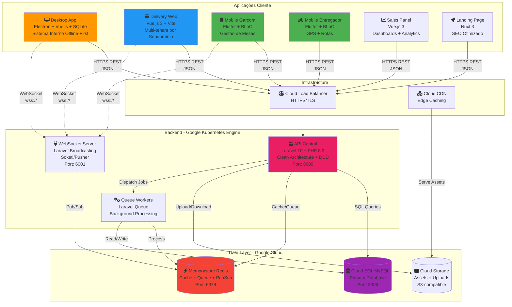
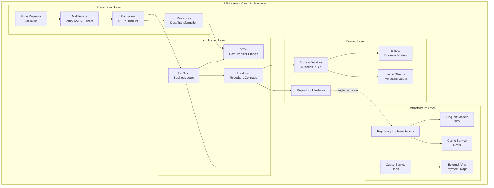
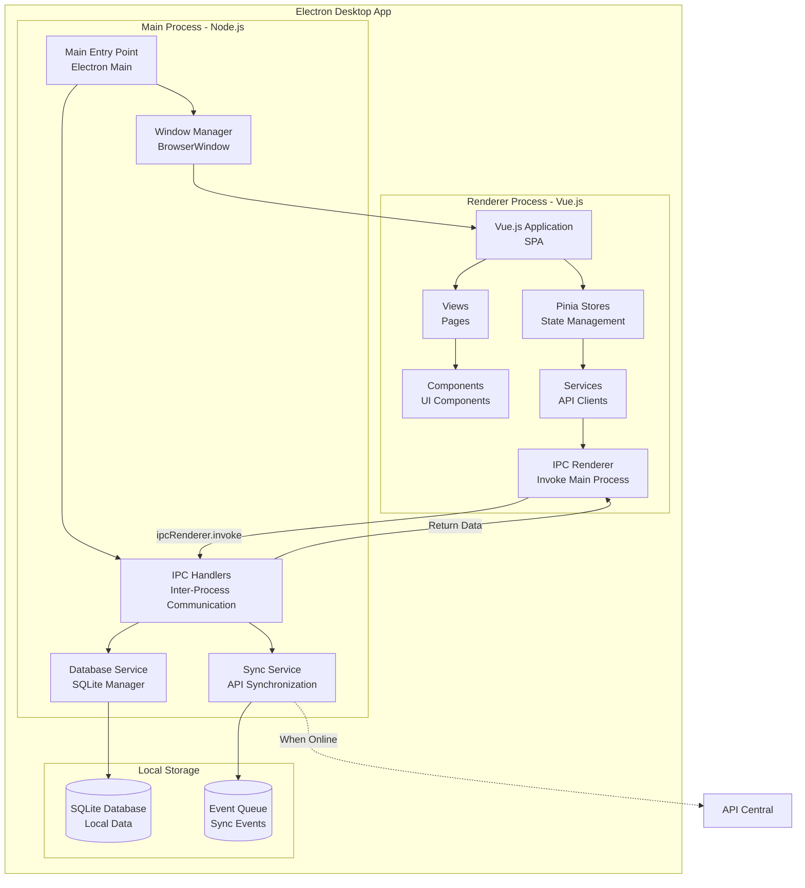
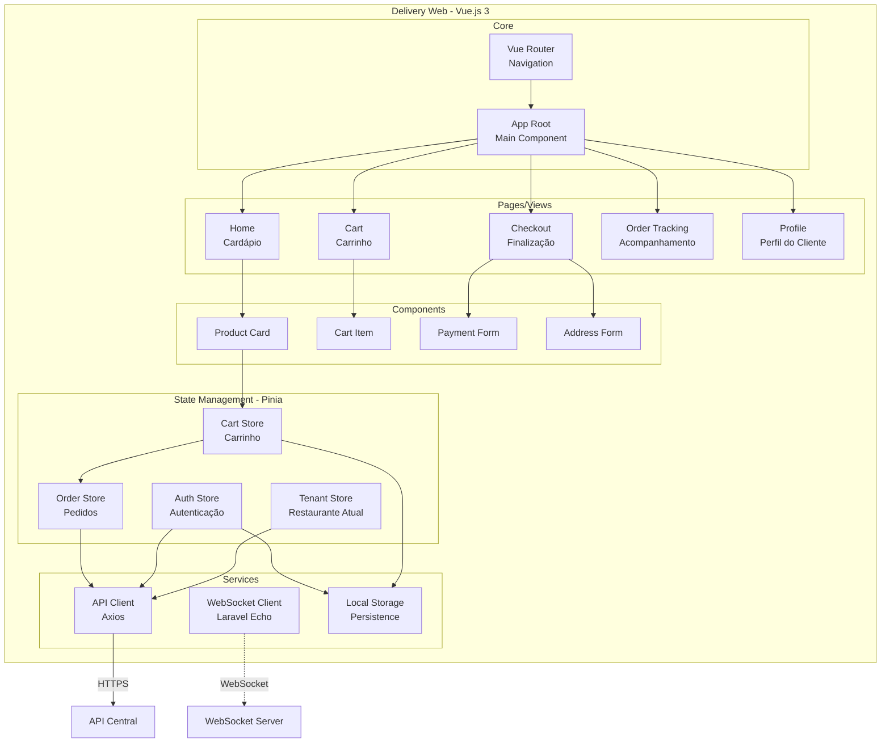
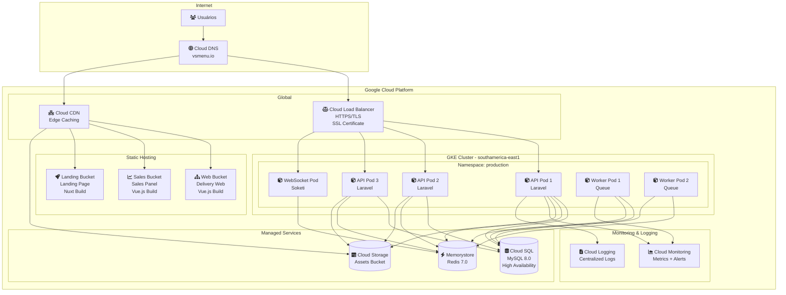
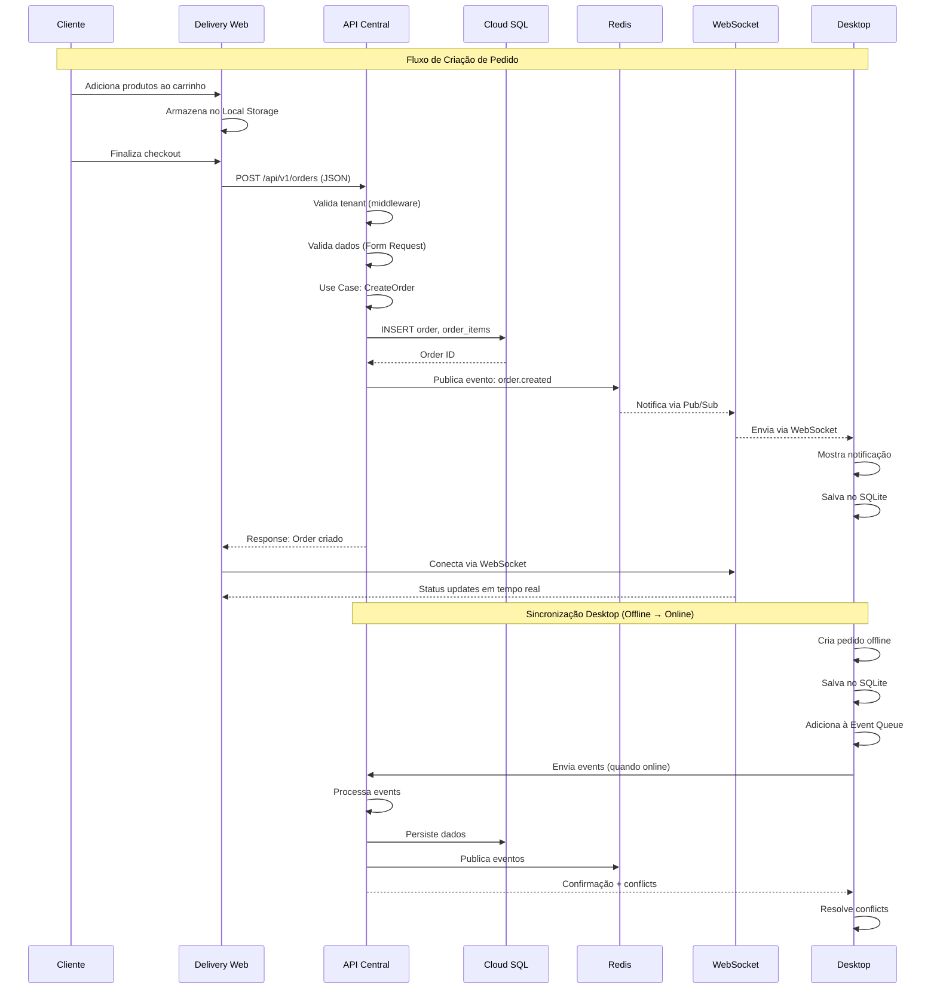

# Diagrama de Componentes Arquiteturais

Documentação detalhada dos componentes do VSmenu 2.0 usando o modelo C4 (Context, Containers, Components, Code).

## 📊 Diagrama C4 - Nível 2: Containers

Visão geral de todas as aplicações (containers) e como elas se comunicam.

## 🔧 Diagrama C4 - Nível 3: Components (API Laravel)

Detalhamento interno da API Laravel seguindo Clean Architecture.

### Principais Componentes da API

#### Presentation Layer
- **Controllers**: Recebem requests HTTP, delegam para use cases
- **Middleware**: Autenticação (Sanctum), Tenant Detection, CORS
- **Form Requests**: Validação de entrada
- **Resources**: Transformação de dados para JSON

#### Application Layer
- **Use Cases**: Orquestração da lógica de negócio
- **DTOs**: Transferência de dados entre camadas
- **Interfaces**: Contratos para repositories

#### Domain Layer
- **Entities**: Modelos de negócio puros (Product, Order, Table)
- **Value Objects**: Valores imutáveis (Money, Email, CPF)
- **Domain Services**: Regras de negócio complexas
- **Repository Interfaces**: Contratos de persistência

#### Infrastructure Layer
- **Eloquent Models**: ORM do Laravel
- **Repositories**: Implementação de persistência
- **Cache Service**: Redis caching
- **Queue Service**: Background jobs
- **External APIs**: Integrações externas

## 🖥️ Diagrama C4 - Nível 3: Components (Desktop App)

Detalhamento do app Desktop Electron com arquitetura offline-first.

### Principais Componentes do Desktop

#### Main Process (Node.js)
- **Main Entry**: Inicialização do Electron
- **IPC Handlers**: Processa requisições do renderer
- **Database Service**: Gerencia SQLite (CRUD, migrations)
- **Sync Service**: Sincronização bidirecional com API
- **Window Manager**: Cria e gerencia janelas

#### Renderer Process (Vue.js)
- **Vue App**: Single Page Application
- **Views**: Páginas (PDV, Mesas, Estoque, etc)
- **Components**: Componentes reutilizáveis
- **Stores (Pinia)**: State management global
- **Services**: Comunicação com Main via IPC

#### Local Storage
- **SQLite**: Dados estruturados offline
- **Event Queue**: Fila de eventos para sync

## 🌐 Diagrama C4 - Nível 3: Components (Delivery Web)

Detalhamento do frontend web multi-tenant.

### Principais Componentes do Delivery Web

#### Core
- **Vue Router**: Gerenciamento de rotas e navegação
- **App Root**: Componente raiz da aplicação

#### Pages/Views
- **Home**: Cardápio do restaurante
- **Cart**: Carrinho de compras
- **Checkout**: Finalização e pagamento
- **Order Tracking**: Acompanhamento em tempo real
- **Profile**: Perfil e histórico do cliente

#### State Management (Pinia)
- **Auth Store**: Autenticação do cliente
- **Tenant Store**: Dados do restaurante atual (multi-tenant)
- **Cart Store**: Gerenciamento do carrinho
- **Order Store**: Pedidos e histórico

#### Services
- **API Client**: Comunicação REST com API
- **WebSocket Client**: Eventos em tempo real
- **Local Storage**: Persistência local (cart, auth)

## 🚀 Diagrama de Deploy - Google Cloud Platform

Como as aplicações são deployed na infraestrutura GCP.

### Infraestrutura GCP

#### Compute
- **GKE Cluster**: Kubernetes Engine para API e Workers
- **Pods**: Containers com auto-scaling
- **Load Balancer**: Distribuição de carga HTTPS

#### Storage
- **Cloud SQL**: MySQL gerenciado com HA
- **Memorystore**: Redis gerenciado
- **Cloud Storage**: Object storage para assets

#### Static Hosting
- **Buckets**: Hospedagem de SPAs Vue.js/Nuxt
- **Cloud CDN**: Edge caching global

#### Observability
- **Cloud Monitoring**: Métricas e alertas
- **Cloud Logging**: Logs centralizados

## 📊 Diagrama de Fluxo de Dados

Como os dados fluem entre os componentes.

## 🔐 Diagrama de Segurança

Camadas de segurança no sistema.

```mermaid
graph TB
    subgraph "Segurança em Camadas"
        subgraph "Layer 1: Network Security"
            FIREWALL[Cloud Firewall<br/>Regras de Acesso]
            VPC[VPC Network<br/>Isolamento]
            TLS[TLS 1.3<br/>Criptografia em Trânsito]
        end
        
        subgraph "Layer 2: Application Security"
            AUTH[Laravel Sanctum<br/>API Tokens]
            CORS[CORS Policy<br/>Origin Control]
            RATE[Rate Limiting<br/>Throttling]
            VALIDATION[Input Validation<br/>Form Requests]
        end
        
        subgraph "Layer 3: Data Security"
            ENCRYPTION[Data Encryption<br/>At Rest]
            TENANT_ISO[Tenant Isolation<br/>Multi-tenancy]
            SQL_PREVENT[SQL Injection Prevention<br/>Eloquent ORM]
        end
        
        subgraph "Layer 4: Access Control"
            RBAC[Roles & Permissions<br/>RBAC]
            POLICIES[Laravel Policies<br/>Resource Authorization]
            IAM[GCP IAM<br/>Infrastructure Access]
        end
    end
    
    FIREWALL --> VPC
    VPC --> TLS
    TLS --> AUTH
    AUTH --> CORS
    CORS --> RATE
    RATE --> VALIDATION
    VALIDATION --> ENCRYPTION
    ENCRYPTION --> TENANT_ISO
    TENANT_ISO --> SQL_PREVENT
    SQL_PREVENT --> RBAC
    RBAC --> POLICIES
    POLICIES --> IAM
```

## 📖 Legenda e Convenções

### Cores nos Diagramas

- 🟠 **Laranja**: Aplicações cliente (Desktop, Mobile)
- 🔵 **Azul**: Frontend Web
- 🟢 **Verde**: Mobile Apps (Flutter)
- 🔴 **Vermelho**: Backend/API
- 🟣 **Roxo**: Databases
- ⚫ **Cinza**: Infraestrutura

### Tipos de Conexão

- **Linha Sólida (→)**: Comunicação síncrona (HTTP REST)
- **Linha Tracejada (-.->)**: Comunicação assíncrona (WebSocket, Events)
- **Linha Grossa (==>)**: Fluxo de dados principal

### Ícones

- 🖥️ Desktop Application
- 🌐 Web Application
- 📱 Mobile Application
- 🔌 API/Service
- 💾 Database
- ⚡ Cache/Queue
- 📦 Storage

## 🔗 Documentação Relacionada

- [Overview da Arquitetura](./index.md) - Visão geral do sistema
- [Decisões Arquiteturais (ADRs)](./decisions/) - Por que escolhemos cada tecnologia
- [Fluxo de Dados](./data-flow.md) - Detalhes de como os dados fluem
- [Comunicação entre Serviços](./service-communication.md) - Protocolos e padrões

## 📚 Referências

- [C4 Model Documentation](https://c4model.com/)
- [Mermaid Diagram Syntax](https://mermaid.js.org/)
- [Clean Architecture by Uncle Bob](https://blog.cleancoder.com/uncle-bob/2012/08/13/the-clean-architecture.html)
- [Google Cloud Architecture](https://cloud.google.com/architecture)

---

[⬅️ Voltar para Overview da Arquitetura](./index.md)

