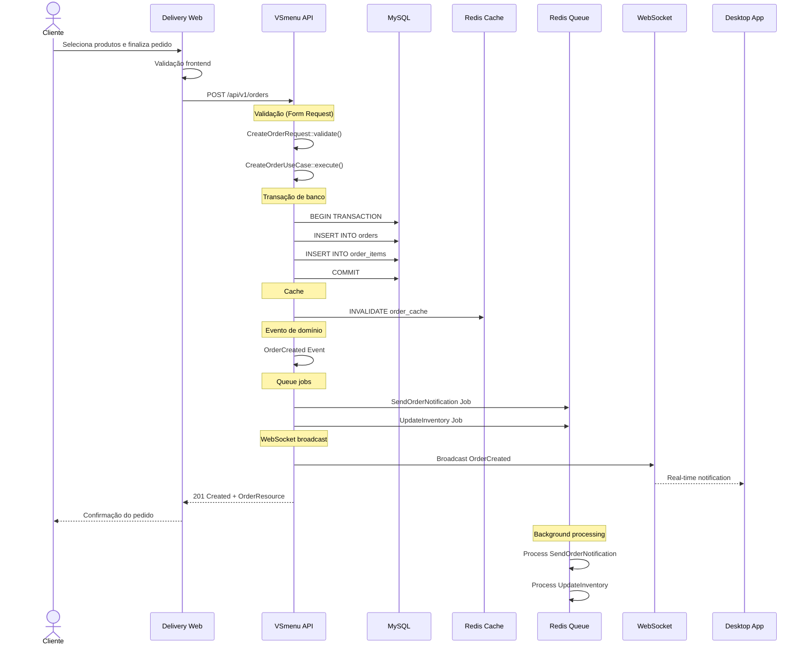
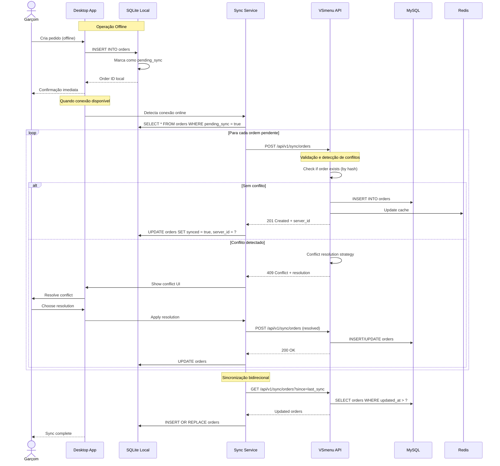
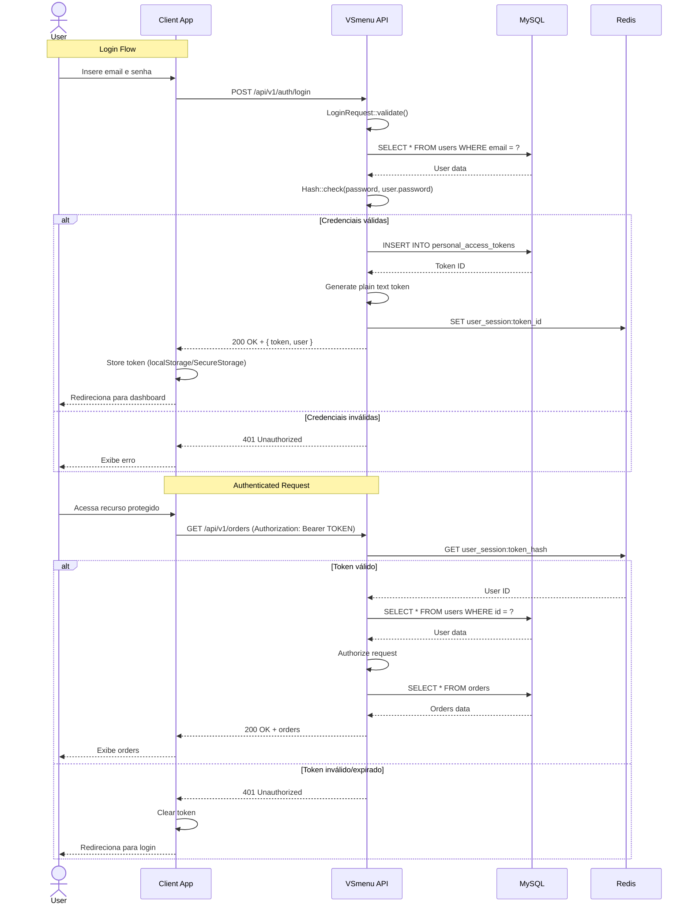
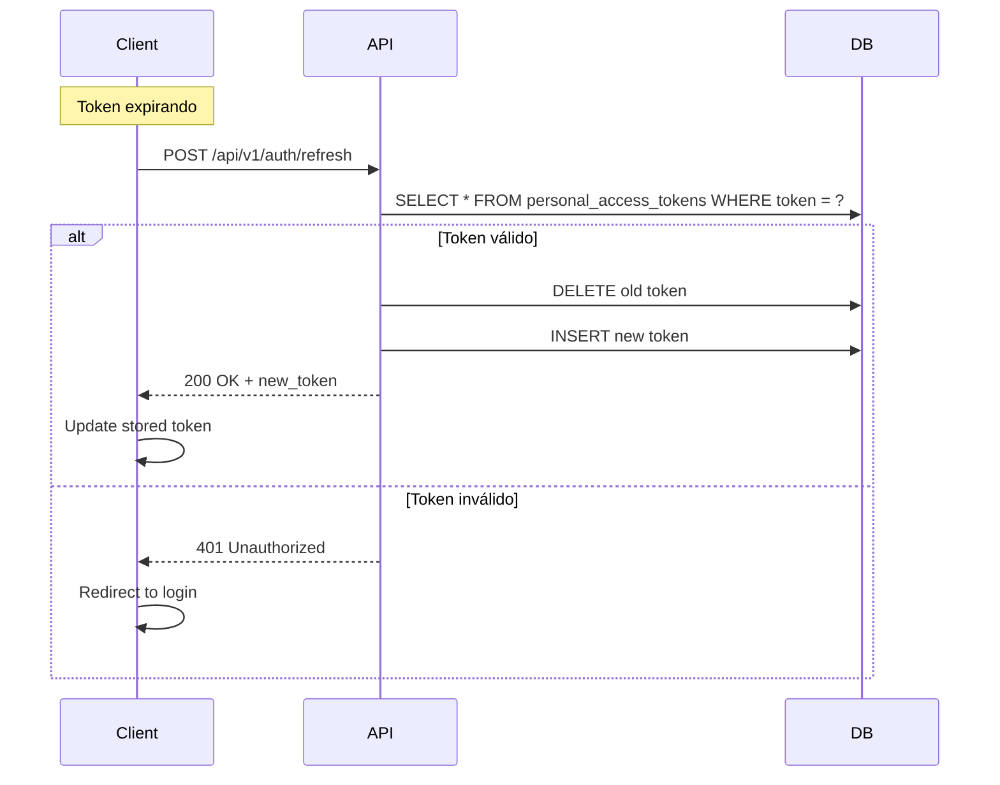
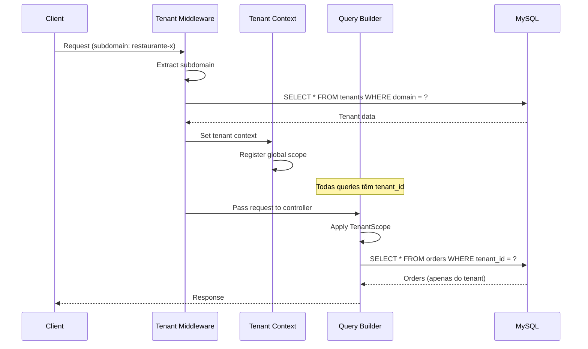
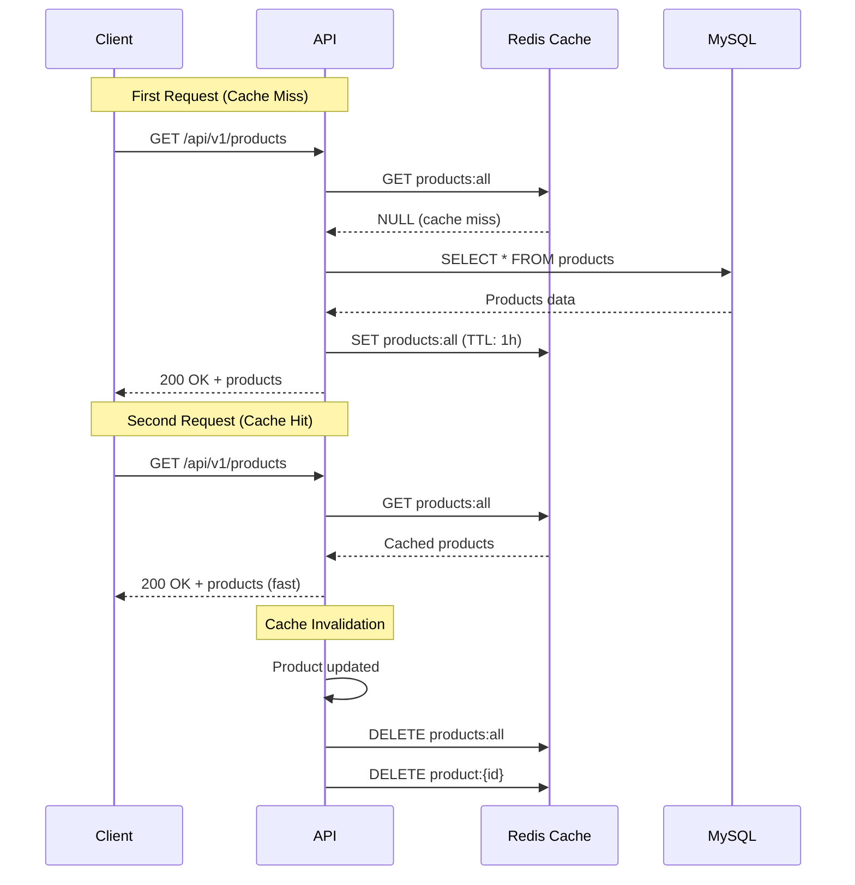
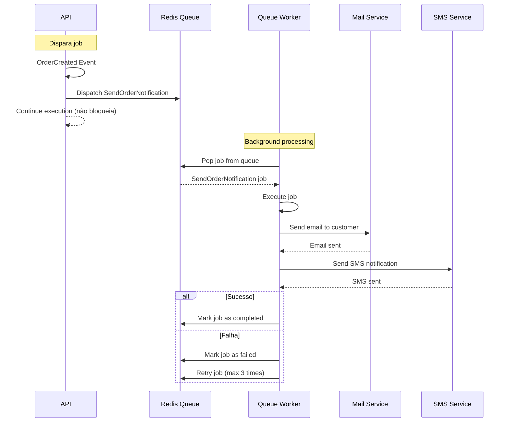
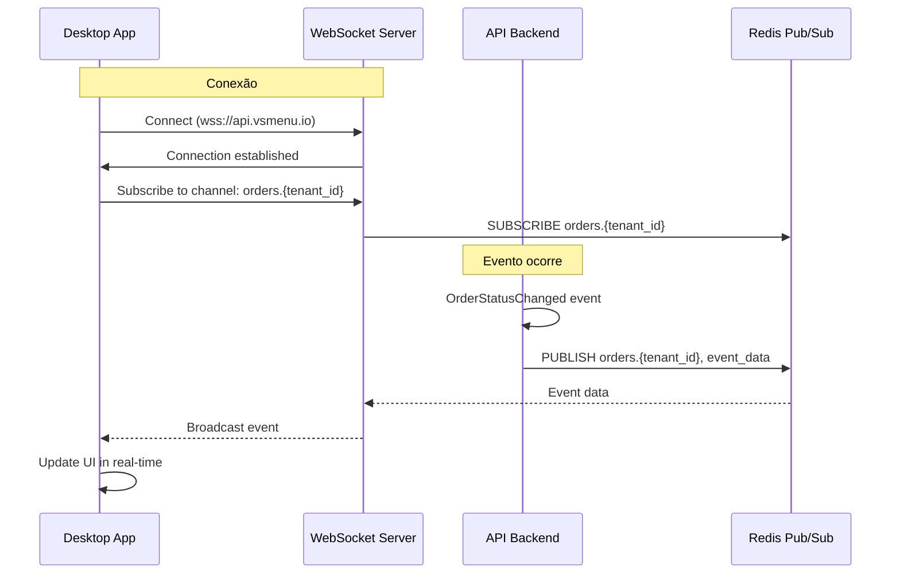
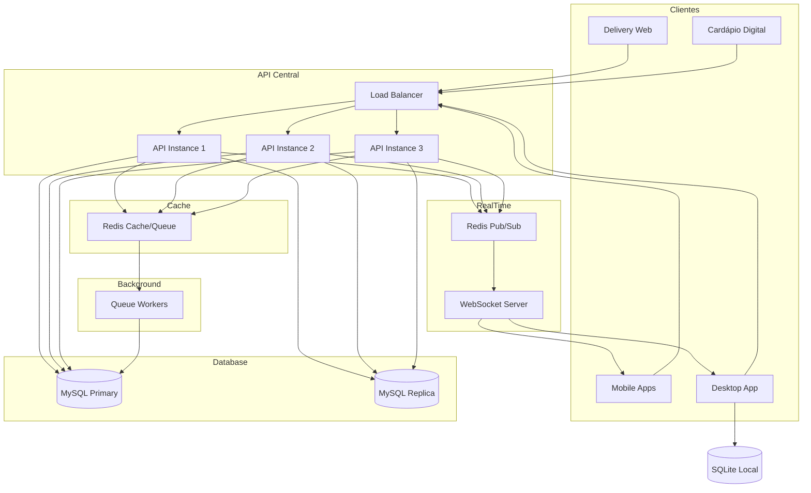

# Fluxo de Dados no Sistema

Documentação completa de como os dados fluem entre componentes, sincronização e transformações no VSmenu 2.0.

## 🎯 Visão Geral

Os fluxos de dados no VSmenu 2.0 são projetados para garantir:
- **Consistência**: Dados sincronizados entre todos os componentes
- **Confiabilidade**: Tratamento de erros e retry logic
- **Performance**: Cache e otimização de queries
- **Offline-first**: Desktop funciona sem conexão
- **Real-time**: WebSocket para atualizações instantâneas

### Tipos de Fluxo

| Tipo | Protocolo | Uso | Sincronicidade |
|------|-----------|-----|----------------|
| **REST API** | HTTP/HTTPS | CRUD operations | Síncrono |
| **WebSocket** | WSS | Real-time updates | Assíncrono |
| **Queue** | Redis | Background jobs | Assíncrono |
| **Desktop Sync** | HTTP + SQLite | Offline sync | Híbrido |

## 📊 Fluxos Principais

### 1. Fluxo de Criação de Pedido

Fluxo completo desde o cliente até a persistência e notificações.

#### Diagrama de Sequência



#### Passo a Passo

1. **Frontend (Delivery Web)**
   - Cliente adiciona produtos ao carrinho
   - Validação de formulário (campo obrigatórios, quantidade)
   - Cálculo de total
   - Envio via Axios para API

2. **API - Validação**
   - `CreateOrderRequest` valida entrada
   - Regras: customer existe, produtos válidos, quantidades positivas

3. **API - Use Case**
   - `CreateOrderUseCase::execute()`
   - Validações de negócio (estoque disponível, etc.)
   - Inicia transação de banco

4. **API - Persistência**
   - Insert na tabela `orders`
   - Insert em `order_items` (múltiplos itens)
   - Commit da transação

5. **API - Cache**
   - Invalida cache de pedidos do cliente
   - Invalida cache de estatísticas

6. **API - Eventos**
   - Dispara `OrderCreated` event
   - Listeners processam ações relacionadas

7. **API - Queue**
   - `SendOrderNotification`: Email/SMS para cliente e restaurante
   - `UpdateInventory`: Atualiza estoque dos produtos

8. **API - WebSocket**
   - Broadcast para canal do tenant
   - Desktop App recebe notificação em tempo real

9. **API - Response**
   - Retorna `OrderResource` (JSON transformado)
   - Status 201 Created

10. **Frontend - Confirmação**
    - Exibe confirmação para cliente
    - Redireciona para página de acompanhamento

#### Código de Exemplo

**Frontend (Vue.js)**:
```javascript
// services/orderService.js
async createOrder(orderData) {
  const { data } = await axios.post('/api/v1/orders', orderData)
  return data.data
}

// stores/useOrderStore.js
async createOrder(orderData) {
  this.isLoading = true
  try {
    const order = await orderService.createOrder(orderData)
    this.orders.push(order)
    return order
  } catch (error) {
    this.error = error.message
    throw error
  } finally {
    this.isLoading = false
  }
}
```

**Backend (Laravel)**:
```php
// OrderController.php
public function store(CreateOrderRequest $request): JsonResponse
{
    $dto = CreateOrderDTO::fromRequest($request);
    $order = $this->createOrderUseCase->execute($dto);
    
    return response()->json(
        new OrderResource($order),
        201
    );
}

// CreateOrderUseCase.php
public function execute(CreateOrderDTO $dto): Order
{
    return DB::transaction(function () use ($dto) {
        // Criar pedido
        $order = $this->orderRepository->create($dto->toArray());
        
        // Disparar eventos
        event(new OrderCreated($order));
        
        return $order;
    });
}
```

---

### 2. Fluxo de Sincronização Desktop ↔ API

Sincronização offline-first entre Desktop App e API Central.

#### Diagrama de Sequência



#### Estratégia de Sincronização

**Event Sourcing**:
- Cada operação gera um evento com timestamp e hash
- Eventos são armazenados localmente e sincronizados
- API reconstrói estado a partir dos eventos

**Resolução de Conflitos**:
1. **Last Write Wins**: Última atualização prevalece
2. **Manual Resolution**: Usuário escolhe versão
3. **Merge**: Combina alterações quando possível

**Detecção de Conflitos**:
```javascript
// Desktop - Sync Service
async syncOrder(localOrder) {
  const hash = this.generateHash(localOrder)
  
  try {
    const response = await api.post('/sync/orders', {
      ...localOrder,
      hash,
      timestamp: localOrder.updated_at
    })
    
    await this.markAsSynced(localOrder.id, response.data.server_id)
  } catch (error) {
    if (error.status === 409) {
      // Conflito detectado
      await this.handleConflict(localOrder, error.data)
    }
  }
}

generateHash(order) {
  const data = JSON.stringify({
    customer_id: order.customer_id,
    items: order.items,
    total: order.total
  })
  return sha256(data)
}
```

**Backend - Conflict Detection**:
```php
// API - SyncController
public function syncOrders(Request $request)
{
    $hash = $request->input('hash');
    $timestamp = $request->input('timestamp');
    
    // Busca ordem existente com mesmo hash
    $existingOrder = Order::where('hash', $hash)->first();
    
    if ($existingOrder) {
        // Compara timestamps
        if ($existingOrder->updated_at > $timestamp) {
            return response()->json([
                'conflict' => true,
                'server_version' => new OrderResource($existingOrder)
            ], 409);
        }
    }
    
    // Sem conflito, cria/atualiza
    $order = $this->orderRepository->createOrUpdate($request->all());
    
    return response()->json(new OrderResource($order), 201);
}
```

---

### 3. Fluxo de Autenticação

Autenticação com Laravel Sanctum e tokens.

#### Diagrama de Sequência



#### Fluxo de Refresh Token



---

### 4. Fluxo de Multi-tenancy

Isolamento de dados por tenant (restaurante).

#### Diagrama de Sequência



#### Código de Exemplo

```php
// TenantMiddleware
class TenantMiddleware
{
    public function handle(Request $request, Closure $next)
    {
        // Detecta tenant pelo subdomínio
        $subdomain = $request->getHost();
        $tenant = Tenant::where('domain', $subdomain)->firstOrFail();
        
        // Define tenant no contexto
        app()->instance('tenant', $tenant);
        
        // Aplica global scope
        Model::addGlobalScope('tenant', function ($query) use ($tenant) {
            $query->where('tenant_id', $tenant->id);
        });
        
        return $next($request);
    }
}

// Model com Tenant Scope
class Order extends Model
{
    protected static function booted()
    {
        static::addGlobalScope(new TenantScope);
        
        // Auto-set tenant_id ao criar
        static::creating(function ($model) {
            if (app()->has('tenant')) {
                $model->tenant_id = app('tenant')->id;
            }
        });
    }
}
```

---

### 5. Fluxo de Cache

Estratégia de cache para performance.

#### Diagrama de Sequência



#### Cache Strategy

**Camadas de Cache**:
1. **Browser Cache**: Assets estáticos
2. **CDN Cache**: Imagens, CSS, JS
3. **Application Cache (Redis)**: Queries e dados computados
4. **Database Query Cache**: MySQL query cache

**Cache Keys**:
```php
// Padrão de chaves
'products:all'                    // Lista de produtos
'product:{id}'                    // Produto específico
'orders:customer:{id}'            // Pedidos de um cliente
'stats:daily:{date}'              // Estatísticas do dia
```

**Código de Exemplo**:
```php
// ProductRepository
public function findAll(): Collection
{
    return Cache::remember('products:all', 3600, function () {
        return Product::with('category')->get();
    });
}

public function find(int $id): ?Product
{
    return Cache::remember("product:{$id}", 3600, function () use ($id) {
        return Product::with('category')->find($id);
    });
}

// Invalidação ao atualizar
public function update(int $id, array $data): Product
{
    $product = Product::findOrFail($id);
    $product->update($data);
    
    // Invalida caches relacionados
    Cache::forget("product:{$id}");
    Cache::forget('products:all');
    
    return $product;
}
```

---

### 6. Fluxo de Queue (Jobs Assíncronos)

Processamento assíncrono com Laravel Queue.

#### Diagrama de Sequência



#### Tipos de Jobs

**Jobs Comuns**:
- `SendOrderNotification`: Envia email/SMS de confirmação
- `UpdateInventory`: Atualiza estoque após pedido
- `GenerateInvoice`: Gera PDF da nota fiscal
- `ProcessPayment`: Processa pagamento assíncrono
- `SyncWithExternalAPI`: Sincroniza com APIs externas (iFood, etc.)

**Código de Exemplo**:
```php
// Job
class SendOrderNotification implements ShouldQueue
{
    use Dispatchable, InteractsWithQueue, Queueable, SerializesModels;

    public function __construct(
        private Order $order
    ) {}

    public function handle()
    {
        // Envia email
        Mail::to($this->order->customer->email)
            ->send(new OrderConfirmationMail($this->order));
        
        // Envia SMS
        SMS::to($this->order->customer->phone)
            ->send("Seu pedido #{$this->order->id} foi confirmado!");
    }

    public function failed(Throwable $exception)
    {
        // Log erro
        Log::error('Failed to send order notification', [
            'order_id' => $this->order->id,
            'error' => $exception->getMessage()
        ]);
    }
}

// Dispatch
event(new OrderCreated($order));

// Event Listener
class SendOrderNotificationListener
{
    public function handle(OrderCreated $event)
    {
        SendOrderNotification::dispatch($event->order)
            ->onQueue('notifications')
            ->delay(now()->addSeconds(5));
    }
}
```

---

## 🔄 Sincronização em Tempo Real (WebSocket)

### Fluxo WebSocket



### Eventos WebSocket

**Canais**:
- `orders.{tenant_id}`: Novos pedidos e atualizações
- `tables.{tenant_id}`: Status de mesas
- `kitchen.{tenant_id}`: Pedidos para cozinha
- `private.user.{user_id}`: Notificações pessoais

**Eventos**:
```javascript
// Frontend - Escutar eventos
window.Echo.private(`orders.${tenantId}`)
  .listen('OrderCreated', (e) => {
    console.log('Novo pedido:', e.order)
    orderStore.addOrder(e.order)
    showNotification('Novo pedido recebido!')
  })
  .listen('OrderStatusChanged', (e) => {
    console.log('Status alterado:', e.order)
    orderStore.updateOrder(e.order)
  })
```

```php
// Backend - Disparar evento
broadcast(new OrderCreated($order))->toOthers();
broadcast(new OrderStatusChanged($order));
```

---

## 📋 Transformações de Dados

### DTOs (Data Transfer Objects)

```php
// CreateOrderDTO
class CreateOrderDTO
{
    public function __construct(
        public int $customerId,
        public array $items,
        public ?int $tableId = null,
        public ?string $notes = null
    ) {}

    public static function fromRequest(Request $request): self
    {
        return new self(
            customerId: $request->input('customer_id'),
            items: $request->input('items'),
            tableId: $request->input('table_id'),
            notes: $request->input('notes')
        );
    }

    public function toArray(): array
    {
        return [
            'customer_id' => $this->customerId,
            'items' => $this->items,
            'table_id' => $this->tableId,
            'notes' => $this->notes,
            'total' => $this->calculateTotal(),
            'status' => 'pending'
        ];
    }

    private function calculateTotal(): float
    {
        return array_reduce($this->items, function ($carry, $item) {
            return $carry + ($item['price'] * $item['quantity']);
        }, 0);
    }
}
```

### API Resources

```php
// OrderResource
class OrderResource extends JsonResource
{
    public function toArray($request): array
    {
        return [
            'id' => $this->id,
            'customer' => new CustomerResource($this->whenLoaded('customer')),
            'table' => new TableResource($this->whenLoaded('table')),
            'items' => OrderItemResource::collection($this->whenLoaded('items')),
            'status' => $this->status,
            'total' => number_format($this->total, 2, '.', ''),
            'notes' => $this->notes,
            'created_at' => $this->created_at->toIso8601String(),
            'updated_at' => $this->updated_at->toIso8601String(),
        ];
    }
}
```

---

## 🔍 Validação em Múltiplas Camadas

### Camada 1: Frontend (Cliente)
- Validação de campos obrigatórios
- Formato de dados (email, telefone, CPF)
- Lógica de UI (quantidade positiva, etc.)

### Camada 2: API - Form Request (Laravel)
- Validação de entrada HTTP
- Regras de validação
- Sanitização

### Camada 3: Use Case (Application)
- Validações de negócio
- Regras complexas
- Consistência de dados

### Camada 4: Domain (Entity)
- Invariantes de domínio
- Regras de negócio puras

**Exemplo Completo**:
```php
// 1. Frontend
const rules = {
  customer_id: 'required',
  items: 'required|min:1'
}

// 2. Form Request
class CreateOrderRequest extends FormRequest
{
    public function rules()
    {
        return [
            'customer_id' => 'required|exists:customers,id',
            'items' => 'required|array|min:1',
            'items.*.product_id' => 'required|exists:products,id',
            'items.*.quantity' => 'required|integer|min:1|max:99',
        ];
    }
}

// 3. Use Case
class CreateOrderUseCase
{
    public function execute(CreateOrderDTO $dto): Order
    {
        // Validação de negócio
        if (count($dto->items) > 50) {
            throw new BusinessException('Maximum 50 items per order');
        }
        
        // Verifica estoque
        foreach ($dto->items as $item) {
            if (!$this->inventoryService->hasStock($item['product_id'], $item['quantity'])) {
                throw new OutOfStockException();
            }
        }
        
        return $this->orderRepository->create($dto->toArray());
    }
}

// 4. Domain Entity
class Order
{
    public function addItem(OrderItem $item): void
    {
        // Invariante: quantidade deve ser positiva
        if ($item->quantity <= 0) {
            throw new DomainException('Quantity must be positive');
        }
        
        $this->items[] = $item;
    }
}
```

---

## 📊 Diagrama Consolidado de Fluxo de Dados



---

## 📚 Boas Práticas

### 1. Idempotência
- Operações podem ser repetidas sem efeitos colaterais
- Usar IDs únicos para requests
- Verificar duplicatas antes de criar

### 2. Retry Logic
- Retry automático em caso de falha temporária
- Exponential backoff
- Limite de tentativas

### 3. Error Handling
- Tratamento de erros em todas as camadas
- Logs detalhados
- Mensagens amigáveis para usuário

### 4. Performance
- Cache agressivo
- Queries otimizadas (N+1)
- Paginação
- Lazy loading

### 5. Segurança
- Validação em múltiplas camadas
- Sanitização de entrada
- HTTPS obrigatório
- Rate limiting

---

## 🔗 Referências

- [DOC-005: Fluxos de Processos](https://github.com/vsmenu/vsmenu-documentos/blob/main/docs/DOC-005-Fluxos-de-Processos.md)
- [Laravel Queue](https://laravel.com/docs/queues)
- [Laravel Broadcasting](https://laravel.com/docs/broadcasting)
- [Event Sourcing](https://martinfowler.com/eaaDev/EventSourcing.html)

---

**Última Atualização**: Dezembro 2025  
**Responsável**: Equipe de Arquitetura VSmenu  
**Revisão**: Trimestral

[⬅️ Voltar para Arquitetura](./index.md)
