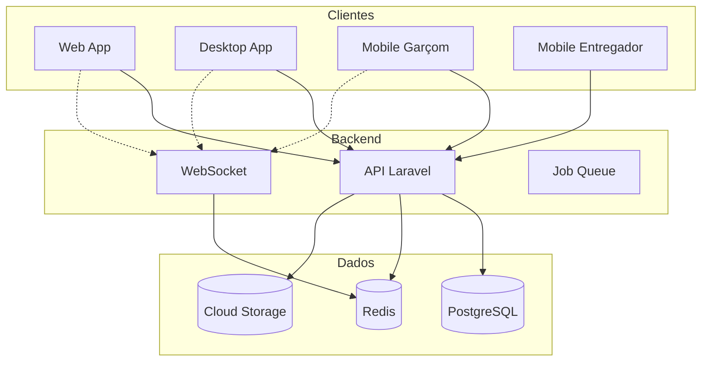

# Diagramas de Arquitetura

Diagramas visuais para compreender a arquitetura do VSmenu 2.0.

## 🎯 Diagramas Disponíveis

::: info Em Desenvolvimento
Diagramas detalhados estão sendo criados.
:::

### Diagrama de Alto Nível

### Diagramas Planejados

- **Diagrama de Componentes** - Visão detalhada dos componentes
- **Diagrama de Sequência** - Fluxos principais do sistema
- **Diagrama de Implantação** - Infraestrutura GCP/Kubernetes
- **Diagrama de Dados** - Modelo de dados (ER)
- **Diagrama de Integração** - APIs e integrações externas

## 📊 Ferramentas

Diagramas criados com:

- **Mermaid** - Diagramas em markdown
- **Draw.io** - Diagramas complexos
- **PlantUML** - Diagramas UML

## 🤝 Contribuindo

Quer adicionar ou melhorar diagramas? Veja o [Guia de Contribuição](/contributing/).

---

**Voltar para:** [Arquitetura](/architecture/)
