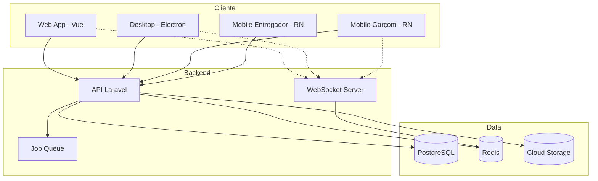

# Arquitetura do Sistema

Visão geral da arquitetura do VSmenu 2.0.

## 🏗️ Visão Geral

O VSmenu 2.0 utiliza uma arquitetura moderna baseada em:

- **Multi-tenancy** - Múltiplos restaurantes isolados na mesma infraestrutura
- **API RESTful** - Comunicação stateless via HTTP
- **WebSocket** - Comunicação em tempo real
- **Microserviços** - Separação de responsabilidades
- **Event-Driven** - Comunicação assíncrona via eventos

## 📊 Diagrama de Arquitetura

## 🔑 Componentes Principais

### API Backend (Laravel)
- Autenticação e autorização
- Lógica de negócio
- Gerenciamento de dados
- Webhooks e integrações

### WebSocket Server
- Notificações em tempo real
- Status de pedidos
- Chat interno
- Eventos do sistema

### Aplicações Cliente
- **Web**: Pedidos delivery e gestão
- **Desktop**: Sistema interno offline-first
- **Mobile Garçom**: Gerenciamento de mesas
- **Mobile Entregador**: Controle de entregas

## 📖 Documentação Detalhada

::: tip Em Desenvolvimento
A documentação completa da arquitetura está sendo construída. Contribuições são bem-vindas!
:::

Explore mais sobre:
- Decisões de arquitetura (ADRs)
- Padrões de design
- Fluxo de dados
- Segurança

---

Próximo: [Documentação da API](/api/)

