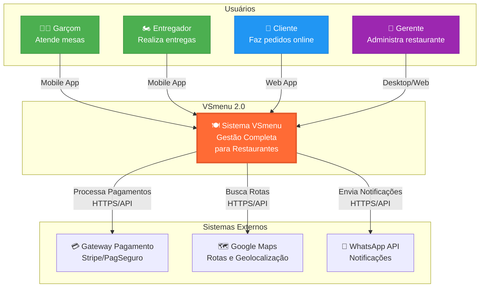
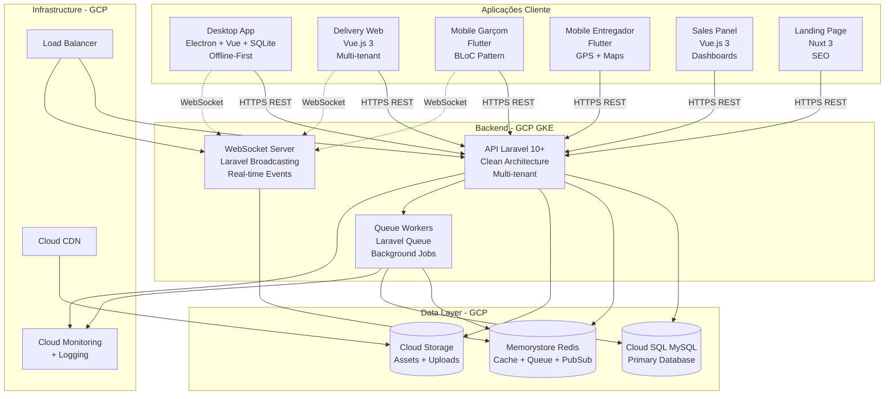

# Overview da Arquitetura do Sistema

Documentação completa da arquitetura do VSmenu 2.0, um sistema moderno e escalável para gestão completa de restaurantes.

## 🎯 Introdução

O **VSmenu 2.0** é um ecossistema completo de aplicações para gestão de restaurantes, delivery e atendimento, construído com arquitetura moderna, escalável e resiliente. O sistema suporta operação offline-first no estabelecimento, multi-tenancy no delivery, e sincronização bidirecional inteligente.

### Principais Características

- ✅ **Offline-First**: Desktop funciona sem internet
- ✅ **Multi-tenant**: Múltiplos restaurantes isolados
- ✅ **Tempo Real**: WebSocket para atualizações instantâneas
- ✅ **Escalável**: Cloud-native com GCP e Kubernetes
- ✅ **Cross-platform**: Web, Desktop, Mobile iOS/Android

## 🏗️ Visão Geral do Ecossistema

O VSmenu 2.0 é composto por **8 aplicações principais** organizadas em camadas:

### Camada de Aplicações Cliente

1. **Desktop App** (Electron + Vue.js + SQLite)
   - Sistema interno do estabelecimento
   - Funciona 100% offline
   - Sincronização bidirecional com API
   - PDV, gestão de mesas, cozinha, estoque

2. **Delivery Web** (Vue.js 3)
   - Plataforma multi-tenant para pedidos online
   - Cada restaurante tem seu subdomínio
   - Cardápio digital, carrinho, checkout
   - Tracking de pedidos em tempo real

3. **Mobile Garçom** (Flutter)
   - App para garçons gerenciarem mesas
   - Tirar pedidos, enviar para cozinha
   - Acompanhar status, fechar comandas
   - Offline-capable com sync

4. **Mobile Entregador** (Flutter)
   - App para entregadores
   - Aceitar entregas, navegação GPS
   - Status em tempo real, histórico
   - Otimização de rotas

5. **Sales Panel** (Vue.js 3)
   - Painel administrativo de vendas
   - Dashboards, relatórios, analytics
   - Gestão de produtos e promoções

6. **Landing Page** (Nuxt 3)
   - Site institucional e captação
   - SEO otimizado
   - Cadastro de novos restaurantes

### Camada de Backend

7. **API Central** (Laravel 10+ / PHP 8.2+)
   - API REST + WebSocket
   - Autenticação com Sanctum
   - Lógica de negócio (DDD)
   - Multi-tenancy
   - Queue processing

### Camada de Design

8. **Design System** (Vue.js 3 + Storybook)
   - Componentes reutilizáveis
   - Tokens de design
   - Documentação de componentes

### Infraestrutura

9. **Infrastructure as Code** (Terraform + GCP)
   - GKE (Kubernetes)
   - Cloud SQL (MySQL)
   - Memorystore (Redis)
   - Cloud Storage, CDN, Load Balancing

## 📊 Diagrama de Contexto do Sistema



## 📊 Diagrama de Arquitetura Completo



## 🔑 Componentes Principais Detalhados

### 1. Desktop App (Electron + Vue.js + SQLite)

**Propósito**: Sistema interno do estabelecimento com operação offline-first.

**Stack Técnica**:
- Electron (processo principal + renderer)
- Vue.js 3 com Composition API
- SQLite para banco local
- Pinia para state management
- IPC para comunicação entre processos

**Funcionalidades**:
- PDV (Ponto de Venda)
- Gestão de mesas e comandas
- Controle de cozinha (KDS)
- Gestão de estoque local
- Relatórios offline
- Sincronização bidirecional com API

**Arquitetura Offline-First**:
- Todos os dados críticos no SQLite local
- Event sourcing para sincronização
- Resolução de conflitos por timestamp + hash
- Queue de eventos para sync quando online

### 2. API Central (Laravel 10+)

**Propósito**: Backend centralizado com toda lógica de negócio.

**Stack Técnica**:
- PHP 8.2+
- Laravel 10+ com Clean Architecture
- MySQL (Cloud SQL)
- Redis (Memorystore)
- Laravel Sanctum para autenticação

**Arquitetura Interna**:
```
app/
├── Domain/           # Entidades, Value Objects, Regras de negócio
├── Application/      # Use Cases, DTOs, Interfaces
├── Infrastructure/   # Repositories, Cache, Queue, External APIs
└── Presentation/     # Controllers, Requests, Resources, Middleware
```

**Princípios**:
- Domain-Driven Design (DDD)
- Clean Architecture
- SOLID principles
- Repository Pattern
- Service Layer

### 3. Delivery Web (Vue.js 3 Multi-tenant)

**Propósito**: Plataforma de pedidos online com subdomínios por restaurante.

**Stack Técnica**:
- Vue.js 3 com Composition API
- Vite como build tool
- Pinia para state management
- TailwindCSS para estilização
- Axios para HTTP

**Multi-tenancy**:
- Identificação por subdomínio: `{tenant}.vsmenu.io`
- Middleware detecta tenant no request
- Query scoping automático por tenant
- Assets e configurações customizáveis por tenant

**Funcionalidades**:
- Cardápio digital personalizado
- Carrinho de compras
- Checkout e pagamento
- Tracking de pedido em tempo real
- Histórico e favoritos

### 4. Mobile Apps (Flutter)

**Propósito**: Apps nativos iOS/Android para garçons e entregadores.

**Stack Técnica**:
- Flutter 3.16+
- BLoC Pattern para state management
- Clean Architecture
- GetIt para dependency injection
- Dio para HTTP client

**Arquitetura**:
```
lib/
└── features/
    └── [feature]/
        ├── data/         # Models, DataSources, Repositories
        ├── domain/       # Entities, UseCases, Interfaces
        └── presentation/ # BLoC, Pages, Widgets
```

**Mobile Garçom**: Gestão de mesas, pedidos, comandas
**Mobile Entregador**: GPS, rotas, status de entrega

### 5. Design System (Vue.js 3 + Storybook)

**Propósito**: Biblioteca de componentes reutilizáveis.

**Stack Técnica**:
- Vue.js 3
- Storybook para documentação
- Design Tokens (cores, tipografia, espaçamento)
- Vitest para testes

**Componentes**:
- Botões, Inputs, Cards, Modals
- Layouts, Grids
- Componentes de negócio específicos

## 🎨 Princípios Arquiteturais

### 1. Domain-Driven Design (DDD)

Separação clara entre:
- **Domain Layer**: Lógica de negócio pura
- **Application Layer**: Casos de uso
- **Infrastructure Layer**: Detalhes técnicos
- **Presentation Layer**: Interface com usuário

### 2. Clean Architecture

- Independência de frameworks
- Testabilidade
- Independência de UI
- Independência de banco de dados
- Independência de agentes externos

### 3. SOLID Principles

- **S**ingle Responsibility
- **O**pen/Closed
- **L**iskov Substitution
- **I**nterface Segregation
- **D**ependency Inversion

### 4. Separation of Concerns

Cada componente tem responsabilidade única e bem definida.

### 5. Scalability by Design

- Stateless services
- Horizontal scaling
- Caching layers
- Queue processing
- Read replicas

## 🛠️ Stack Tecnológica (Resumo)

### Backend
- **Linguagem**: PHP 8.2+
- **Framework**: Laravel 10+
- **Database**: MySQL 8.0 (Cloud SQL)
- **Cache/Queue**: Redis 7+ (Memorystore)
- **Auth**: Laravel Sanctum

### Frontend Web
- **Framework**: Vue.js 3
- **Build Tool**: Vite
- **State**: Pinia
- **Styling**: TailwindCSS
- **HTTP**: Axios

### Mobile
- **Framework**: Flutter 3.16+
- **Language**: Dart
- **State**: BLoC Pattern
- **DI**: GetIt
- **HTTP**: Dio

### Desktop
- **Framework**: Electron
- **Frontend**: Vue.js 3
- **Database**: SQLite 3
- **IPC**: Electron IPC

### Infraestrutura
- **Cloud**: Google Cloud Platform
- **Container**: Docker + Kubernetes (GKE)
- **IaC**: Terraform
- **CI/CD**: GitHub Actions
- **Monitoring**: Cloud Monitoring + Sentry

## 🔄 Comunicação entre Componentes

### REST API

- **Protocolo**: HTTPS
- **Formato**: JSON
- **Auth**: Bearer Token (Sanctum)
- **Versionamento**: `/api/v1/`
- **Padrões**: RESTful conventions

### WebSocket (Laravel Broadcasting)

- **Uso**: Eventos em tempo real
- **Protocolo**: WebSocket (wss://)
- **Autenticação**: Token via query string
- **Eventos**: Pedidos, mesas, notificações

### Sincronização Desktop ↔ API

- **Estratégia**: Event Sourcing
- **Resolução de Conflitos**: Timestamp + Hash
- **Retry Logic**: Exponential backoff
- **Queue Local**: SQLite

## 📈 Escalabilidade e Performance

### Horizontal Scaling

- API stateless com múltiplas instâncias
- Load Balancer distribuindo carga
- Workers escaláveis para queue

### Caching Strategy

- **Application Cache**: Redis
- **Query Cache**: Laravel cache
- **CDN Cache**: Cloud CDN para assets
- **Browser Cache**: Service workers

### Database Optimization

- Índices estratégicos
- Query optimization
- Connection pooling
- Read replicas (futuro)

## 🔒 Segurança

### Autenticação

- Laravel Sanctum (API tokens)
- Password hashing (Bcrypt/Argon2)
- Refresh tokens
- Session management

### Autorização

- Roles e Permissions
- Laravel Policies
- Multi-tenant isolation
- Resource-level authorization

### Proteção

- HTTPS/TLS obrigatório
- CORS configurado
- Rate limiting
- SQL injection prevention (Eloquent ORM)
- XSS prevention
- CSRF protection

## 📚 Documentação Adicional

Explore documentação detalhada sobre cada aspecto:

- [Diagrama de Componentes](./components.md) - Diagramas C4 detalhados
- [Decisões Arquiteturais (ADRs)](./decisions/) - ADRs documentados
- [Stack Tecnológica Completa](./tech-stack.md) - Detalhes de cada tecnologia
- [Padrões de Código](./code-standards.md) - Convenções e boas práticas
- [Estrutura de Projetos](./project-structure.md) - Organização de código
- [Fluxo de Dados](./data-flow.md) - Como dados fluem no sistema
- [Comunicação entre Serviços](./service-communication.md) - Protocolos e padrões
- [Segurança](./security.md) - Arquitetura de segurança
- [Escalabilidade](./scalability.md) - Estratégias de escala
- [Performance](./performance.md) - Otimizações e métricas
- [Testes](./testing.md) - Estratégias de teste

## 🔗 Repositórios Relacionados

- [vsmenu-api](https://github.com/vsmenu/vsmenu-api) - Backend Laravel
- [vsmenu-delivery-web](https://github.com/vsmenu/vsmenu-delivery-web) - Frontend Web Delivery
- [vsmenu-desktop](https://github.com/vsmenu/vsmenu-desktop) - Desktop Electron
- [vsmenu-mobile-waiter](https://github.com/vsmenu/vsmenu-mobile-waiter) - Mobile Garçom Flutter
- [vsmenu-mobile-deliverer](https://github.com/vsmenu/vsmenu-mobile-deliverer) - Mobile Entregador Flutter
- [vsmenu-sales-panel](https://github.com/vsmenu/vsmenu-sales-panel) - Painel de Vendas
- [vsmenu-landing](https://github.com/vsmenu/vsmenu-landing) - Landing Page Nuxt
- [vsmenu-design-system](https://github.com/vsmenu/vsmenu-design-system) - Design System
- [vsmenu-infrastructure](https://github.com/vsmenu/vsmenu-infrastructure) - IaC Terraform

## 📖 Referências Externas

### Documentação Técnica Base
- [DOC-001 - Especificação Arquitetural](https://github.com/vsmenu/vsmenu-documentos/blob/main/docs/DOC-001-Especificacao-Arquitetural.md)
- [DOC-007 - Infraestrutura](https://github.com/vsmenu/vsmenu-documentos/blob/main/docs/DOC-007-Estrategia-de-Implantacao-e-Infraestrutura.md)

### Frameworks e Tecnologias
- [Laravel Documentation](https://laravel.com/docs/10.x)
- [Vue.js Documentation](https://vuejs.org/)
- [Flutter Documentation](https://flutter.dev/docs)
- [Electron Documentation](https://www.electronjs.org/docs)
- [Google Cloud Platform](https://cloud.google.com/docs)

### Padrões Arquiteturais
- [C4 Model](https://c4model.com/)
- [Clean Architecture](https://blog.cleancoder.com/uncle-bob/2012/08/13/the-clean-architecture.html)
- [Domain-Driven Design](https://martinfowler.com/tags/domain%20driven%20design.html)

---

**Próximos Passos**: Explore a documentação detalhada de cada componente nos links acima, ou consulte os [Guias de Desenvolvimento](/guides/) para começar a desenvolver.
