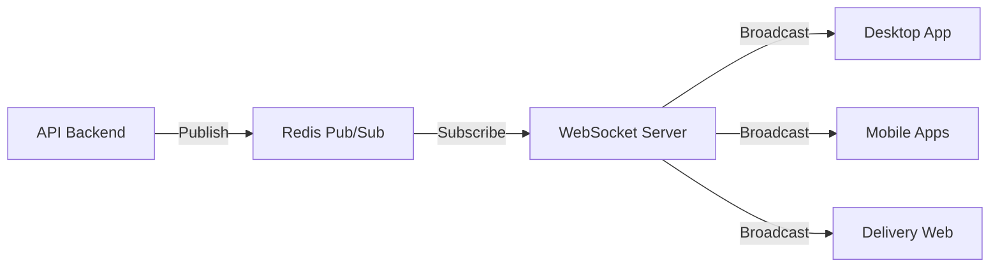
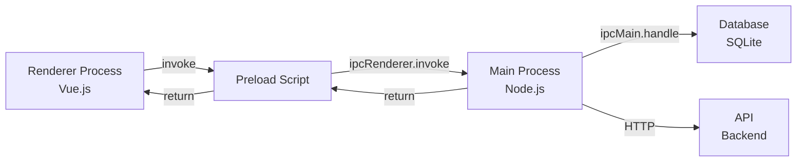
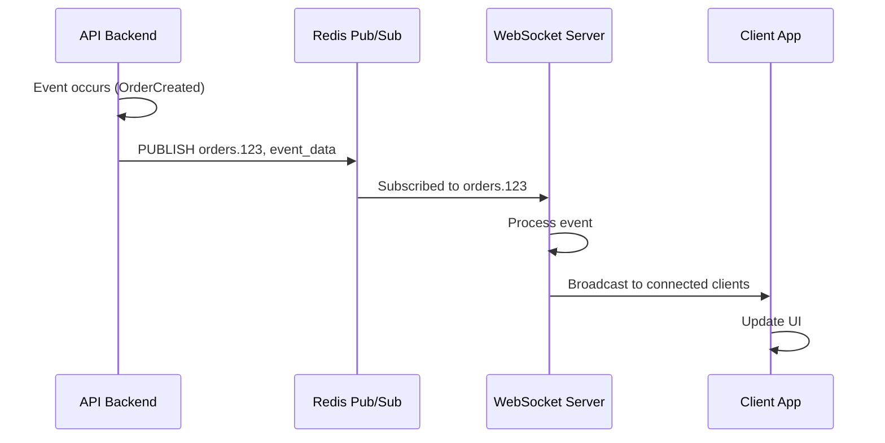

# Comunicação entre Serviços

Documentação completa de como os serviços e componentes do VSmenu 2.0 se comunicam, incluindo protocolos, padrões e exemplos práticos.

## 🎯 Visão Geral

A comunicação entre serviços no VSmenu 2.0 é projetada para ser:
- **Confiável**: Retry logic e tratamento de erros
- **Segura**: Autenticação e criptografia
- **Performática**: Cache e otimizações
- **Escalável**: Suporta crescimento horizontal
- **Real-time**: WebSocket para atualizações instantâneas

### Tipos de Comunicação

| Tipo | Protocolo | Formato | Uso Principal | Sincronicidade |
|------|-----------|---------|---------------|----------------|
| **REST API** | HTTP/HTTPS | JSON | CRUD operations | Síncrono |
| **WebSocket** | WSS | JSON | Real-time updates | Assíncrono |
| **IPC** | Electron IPC | JSON | Desktop Main ↔ Renderer | Síncrono |
| **Queue** | Redis | Serialized PHP | Background jobs | Assíncrono |
| **Pub/Sub** | Redis | JSON | Event broadcasting | Assíncrono |

## 🌐 REST API

### Visão Geral

API RESTful principal do VSmenu 2.0, seguindo padrões REST e convenções HTTP.

#### Endpoints e Versionamento

```
Base URL: https://api.vsmenu.io

Estrutura:
/api/v1/[resource]
/api/v1/[resource]/{id}
/api/v1/[resource]/{id}/[sub-resource]

Exemplos:
GET    /api/v1/orders
POST   /api/v1/orders
GET    /api/v1/orders/123
PUT    /api/v1/orders/123
DELETE /api/v1/orders/123
GET    /api/v1/orders/123/items
```

#### Versionamento

```
v1: Versão atual (estável)
v2: Futuras breaking changes
```

**Estratégia**: Manter v1 por no mínimo 6 meses após lançamento da v2.

### Autenticação

#### Bearer Token (Laravel Sanctum)

```http
Authorization: Bearer {token}
```

**Exemplo de Request**:
```javascript
// Frontend
const response = await axios.get('/api/v1/orders', {
  headers: {
    'Authorization': `Bearer ${token}`,
    'Content-Type': 'application/json',
    'Accept': 'application/json'
  }
})
```

**Backend - Proteção de Rotas**:
```php
// routes/api.php
Route::middleware('auth:sanctum')->group(function () {
    Route::apiResource('orders', OrderController::class);
    Route::apiResource('products', ProductController::class);
    Route::apiResource('customers', CustomerController::class);
});
```

### Request/Response Format

#### Request Body (JSON)

```json
{
  "customer_id": 123,
  "items": [
    {
      "product_id": 456,
      "quantity": 2,
      "price": 25.50
    }
  ],
  "delivery_address_id": 789,
  "payment_method": "credit_card",
  "notes": "Sem cebola"
}
```

#### Response Format (Success)

```json
{
  "data": {
    "id": 1001,
    "customer": {
      "id": 123,
      "name": "João Silva",
      "email": "joao@example.com"
    },
    "items": [
      {
        "id": 5001,
        "product_id": 456,
        "product_name": "Pizza Margherita",
        "quantity": 2,
        "price": 25.50,
        "subtotal": 51.00
      }
    ],
    "total": 51.00,
    "status": "pending",
    "created_at": "2025-12-14T01:30:00Z",
    "updated_at": "2025-12-14T01:30:00Z"
  }
}
```

#### Response Format (Error)

```json
{
  "message": "Validation failed",
  "errors": {
    "customer_id": [
      "O campo customer_id é obrigatório."
    ],
    "items": [
      "O pedido deve conter pelo menos um item."
    ]
  }
}
```

### HTTP Status Codes

| Código | Significado | Uso |
|--------|-------------|-----|
| **200** | OK | Request bem-sucedido (GET, PUT, PATCH) |
| **201** | Created | Recurso criado com sucesso (POST) |
| **204** | No Content | Recurso deletado com sucesso (DELETE) |
| **400** | Bad Request | Validação falhou |
| **401** | Unauthorized | Não autenticado |
| **403** | Forbidden | Sem permissão |
| **404** | Not Found | Recurso não encontrado |
| **409** | Conflict | Conflito (ex: duplicata) |
| **422** | Unprocessable Entity | Validação de negócio falhou |
| **429** | Too Many Requests | Rate limit excedido |
| **500** | Internal Server Error | Erro no servidor |
| **503** | Service Unavailable | Serviço indisponível |

### Convenções RESTful

#### Resource Controllers

```php
// OrderController.php
class OrderController extends Controller
{
    // GET /api/v1/orders
    public function index(Request $request): JsonResponse
    {
        $orders = Order::with('items', 'customer')
            ->where('tenant_id', $request->user()->tenant_id)
            ->paginate(15);
        
        return response()->json(OrderResource::collection($orders));
    }

    // POST /api/v1/orders
    public function store(CreateOrderRequest $request): JsonResponse
    {
        $dto = CreateOrderDTO::fromRequest($request);
        $order = $this->createOrderUseCase->execute($dto);
        
        return response()->json(
            new OrderResource($order),
            201
        );
    }

    // GET /api/v1/orders/{id}
    public function show(int $id): JsonResponse
    {
        $order = Order::with('items', 'customer')->findOrFail($id);
        $this->authorize('view', $order);
        
        return response()->json(new OrderResource($order));
    }

    // PUT/PATCH /api/v1/orders/{id}
    public function update(UpdateOrderRequest $request, int $id): JsonResponse
    {
        $order = Order::findOrFail($id);
        $this->authorize('update', $order);
        
        $order->update($request->validated());
        
        return response()->json(new OrderResource($order));
    }

    // DELETE /api/v1/orders/{id}
    public function destroy(int $id): JsonResponse
    {
        $order = Order::findOrFail($id);
        $this->authorize('delete', $order);
        
        $order->delete();
        
        return response()->json(null, 204);
    }
}
```

### Paginação

```http
GET /api/v1/orders?page=2&per_page=20
```

**Response**:
```json
{
  "data": [...],
  "meta": {
    "current_page": 2,
    "from": 21,
    "last_page": 10,
    "per_page": 20,
    "to": 40,
    "total": 200
  },
  "links": {
    "first": "/api/v1/orders?page=1",
    "last": "/api/v1/orders?page=10",
    "prev": "/api/v1/orders?page=1",
    "next": "/api/v1/orders?page=3"
  }
}
```

### Filtros e Ordenação

```http
GET /api/v1/orders?status=pending&sort=-created_at&include=items,customer
```

**Parâmetros**:
- `status=pending`: Filtrar por status
- `sort=-created_at`: Ordenar por created_at descendente (- = desc)
- `include=items,customer`: Incluir relacionamentos

**Backend Implementation**:
```php
public function index(Request $request): JsonResponse
{
    $query = Order::query();
    
    // Filtros
    if ($request->has('status')) {
        $query->where('status', $request->input('status'));
    }
    
    // Ordenação
    if ($request->has('sort')) {
        $sort = $request->input('sort');
        $direction = str_starts_with($sort, '-') ? 'desc' : 'asc';
        $field = ltrim($sort, '-');
        $query->orderBy($field, $direction);
    }
    
    // Includes
    if ($request->has('include')) {
        $includes = explode(',', $request->input('include'));
        $query->with($includes);
    }
    
    return response()->json(
        OrderResource::collection($query->paginate())
    );
}
```

---

## 🔌 WebSocket (Laravel Broadcasting)

### Visão Geral

WebSocket para comunicação real-time entre API e clientes (Desktop, Mobile, Web).

### Arquitetura



### Configuração

#### Laravel Broadcasting

```php
// config/broadcasting.php
'connections' => [
    'pusher' => [
        'driver' => 'pusher',
        'key' => env('PUSHER_APP_KEY'),
        'secret' => env('PUSHER_APP_SECRET'),
        'app_id' => env('PUSHER_APP_ID'),
        'options' => [
            'cluster' => env('PUSHER_APP_CLUSTER'),
            'host' => env('PUSHER_HOST', '127.0.0.1'),
            'port' => env('PUSHER_PORT', 6001),
            'scheme' => env('PUSHER_SCHEME', 'https'),
            'encrypted' => true,
            'useTLS' => true,
        ],
    ],
],
```

**Servidor**: Soketi (self-hosted Pusher alternative)

### Canais (Channels)

#### Tipos de Canais

1. **Public Channels**: Abertos para todos
2. **Private Channels**: Requer autenticação
3. **Presence Channels**: Rastreia quem está online

#### Estrutura de Canais

```
public:                              # Público (ex: status do sistema)
private.orders.{tenant_id}           # Privado por tenant
private.tables.{tenant_id}           # Mesas por tenant
private.kitchen.{tenant_id}          # Cozinha por tenant
presence.restaurant.{tenant_id}      # Presença (quem está online)
```

### Eventos

#### Definição de Evento

```php
// app/Events/OrderCreated.php
namespace App\Events;

use App\Models\Order;
use Illuminate\Broadcasting\Channel;
use Illuminate\Broadcasting\InteractsWithSockets;
use Illuminate\Broadcasting\PresenceChannel;
use Illuminate\Broadcasting\PrivateChannel;
use Illuminate\Contracts\Broadcasting\ShouldBroadcast;
use Illuminate\Foundation\Events\Dispatchable;
use Illuminate\Queue\SerializesModels;

class OrderCreated implements ShouldBroadcast
{
    use Dispatchable, InteractsWithSockets, SerializesModels;

    public function __construct(
        public Order $order
    ) {}

    public function broadcastOn(): array
    {
        return [
            new PrivateChannel("orders.{$this->order->tenant_id}"),
        ];
    }

    public function broadcastAs(): string
    {
        return 'order.created';
    }

    public function broadcastWith(): array
    {
        return [
            'order' => [
                'id' => $this->order->id,
                'customer_name' => $this->order->customer->name,
                'total' => $this->order->total,
                'status' => $this->order->status,
                'created_at' => $this->order->created_at->toIso8601String(),
            ]
        ];
    }
}
```

#### Disparar Evento

```php
// Controller ou Use Case
event(new OrderCreated($order));

// Ou com broadcast helper
broadcast(new OrderCreated($order))->toOthers();
```

### Cliente (Frontend)

#### Configuração Laravel Echo

```javascript
// main.js ou boot file
import Echo from 'laravel-echo'
import Pusher from 'pusher-js'

window.Pusher = Pusher

window.Echo = new Echo({
  broadcaster: 'pusher',
  key: import.meta.env.VITE_PUSHER_APP_KEY,
  cluster: import.meta.env.VITE_PUSHER_APP_CLUSTER,
  wsHost: import.meta.env.VITE_PUSHER_HOST,
  wsPort: import.meta.env.VITE_PUSHER_PORT,
  wssPort: import.meta.env.VITE_PUSHER_PORT,
  forceTLS: true,
  encrypted: true,
  disableStats: true,
  enabledTransports: ['ws', 'wss'],
  authorizer: (channel) => {
    return {
      authorize: (socketId, callback) => {
        axios.post('/api/v1/broadcasting/auth', {
          socket_id: socketId,
          channel_name: channel.name
        })
        .then(response => {
          callback(false, response.data)
        })
        .catch(error => {
          callback(true, error)
        })
      }
    }
  }
})
```

#### Escutar Eventos

```javascript
// composables/useOrderEvents.js
import { onMounted, onUnmounted } from 'vue'
import { useOrderStore } from '@/stores/useOrderStore'
import { useToast } from '@/composables/useToast'

export function useOrderEvents(tenantId) {
  const orderStore = useOrderStore()
  const toast = useToast()
  
  let channel = null
  
  onMounted(() => {
    // Conectar ao canal
    channel = window.Echo.private(`orders.${tenantId}`)
    
    // Escutar evento de novo pedido
    channel.listen('.order.created', (e) => {
      console.log('Novo pedido:', e.order)
      orderStore.addOrder(e.order)
      toast.success(`Novo pedido #${e.order.id} recebido!`)
      playNotificationSound()
    })
    
    // Escutar mudança de status
    channel.listen('.order.status.changed', (e) => {
      console.log('Status alterado:', e.order)
      orderStore.updateOrder(e.order)
      toast.info(`Pedido #${e.order.id}: ${e.order.status}`)
    })
  })
  
  onUnmounted(() => {
    if (channel) {
      channel.stopListening('.order.created')
      channel.stopListening('.order.status.changed')
      window.Echo.leave(`orders.${tenantId}`)
    }
  })
}
```

#### Uso em Componente

```vue
<script setup>
import { useOrderEvents } from '@/composables/useOrderEvents'
import { useAuthStore } from '@/stores/useAuthStore'

const authStore = useAuthStore()

// Conecta aos eventos
useOrderEvents(authStore.user.tenant_id)
</script>
```

---

## 💻 IPC (Inter-Process Communication) - Desktop

### Visão Geral

Comunicação entre Main Process (Node.js) e Renderer Process (Vue.js) no Electron.

### Arquitetura



### Canais IPC

```javascript
// src/shared/constants/ipcChannels.js
export const IPC_CHANNELS = {
  // Orders
  ORDERS_GET_ALL: 'orders:getAll',
  ORDERS_GET_BY_ID: 'orders:getById',
  ORDERS_CREATE: 'orders:create',
  ORDERS_UPDATE: 'orders:update',
  ORDERS_DELETE: 'orders:delete',
  ORDERS_SYNC: 'orders:sync',
  
  // Products
  PRODUCTS_GET_ALL: 'products:getAll',
  PRODUCTS_GET_BY_ID: 'products:getById',
  
  // Sync
  SYNC_START: 'sync:start',
  SYNC_STATUS: 'sync:status',
  
  // Auth
  AUTH_LOGIN: 'auth:login',
  AUTH_LOGOUT: 'auth:logout',
  AUTH_GET_TOKEN: 'auth:getToken',
}
```

### Main Process - Handlers

```javascript
// src/main/ipc/handlers/orderHandlers.js
const { ipcMain } = require('electron')
const { orderRepository } = require('../../database/repositories/orderRepository')
const { IPC_CHANNELS } = require('../../../shared/constants/ipcChannels')

function registerOrderHandlers() {
  // Get all orders
  ipcMain.handle(IPC_CHANNELS.ORDERS_GET_ALL, async (event, filters) => {
    try {
      return await orderRepository.findAll(filters)
    } catch (error) {
      console.error('Failed to get orders:', error)
      throw error
    }
  })

  // Get order by ID
  ipcMain.handle(IPC_CHANNELS.ORDERS_GET_BY_ID, async (event, id) => {
    try {
      return await orderRepository.findById(id)
    } catch (error) {
      console.error(`Failed to get order ${id}:`, error)
      throw error
    }
  })

  // Create order
  ipcMain.handle(IPC_CHANNELS.ORDERS_CREATE, async (event, orderData) => {
    try {
      const order = await orderRepository.create(orderData)
      
      // Marca para sincronizar
      await orderRepository.markForSync(order.id)
      
      return order
    } catch (error) {
      console.error('Failed to create order:', error)
      throw error
    }
  })

  // Update order
  ipcMain.handle(IPC_CHANNELS.ORDERS_UPDATE, async (event, id, orderData) => {
    try {
      const order = await orderRepository.update(id, orderData)
      await orderRepository.markForSync(order.id)
      return order
    } catch (error) {
      console.error(`Failed to update order ${id}:`, error)
      throw error
    }
  })

  // Sync orders
  ipcMain.handle(IPC_CHANNELS.ORDERS_SYNC, async () => {
    try {
      const { syncService } = require('../../sync/syncService')
      return await syncService.syncOrders()
    } catch (error) {
      console.error('Failed to sync orders:', error)
      throw error
    }
  })
}

module.exports = { registerOrderHandlers }
```

### Preload Script

```javascript
// src/preload/index.js
const { contextBridge, ipcRenderer } = require('electron')
const { IPC_CHANNELS } = require('../shared/constants/ipcChannels')

// Expõe API segura para o renderer
contextBridge.exposeInMainWorld('electronAPI', {
  // Orders
  orders: {
    getAll: (filters) => ipcRenderer.invoke(IPC_CHANNELS.ORDERS_GET_ALL, filters),
    getById: (id) => ipcRenderer.invoke(IPC_CHANNELS.ORDERS_GET_BY_ID, id),
    create: (orderData) => ipcRenderer.invoke(IPC_CHANNELS.ORDERS_CREATE, orderData),
    update: (id, orderData) => ipcRenderer.invoke(IPC_CHANNELS.ORDERS_UPDATE, id, orderData),
    delete: (id) => ipcRenderer.invoke(IPC_CHANNELS.ORDERS_DELETE, id),
    sync: () => ipcRenderer.invoke(IPC_CHANNELS.ORDERS_SYNC),
  },
  
  // Products
  products: {
    getAll: () => ipcRenderer.invoke(IPC_CHANNELS.PRODUCTS_GET_ALL),
    getById: (id) => ipcRenderer.invoke(IPC_CHANNELS.PRODUCTS_GET_BY_ID, id),
  },
  
  // Sync
  sync: {
    start: () => ipcRenderer.invoke(IPC_CHANNELS.SYNC_START),
    getStatus: () => ipcRenderer.invoke(IPC_CHANNELS.SYNC_STATUS),
  },
  
  // Auth
  auth: {
    login: (credentials) => ipcRenderer.invoke(IPC_CHANNELS.AUTH_LOGIN, credentials),
    logout: () => ipcRenderer.invoke(IPC_CHANNELS.AUTH_LOGOUT),
    getToken: () => ipcRenderer.invoke(IPC_CHANNELS.AUTH_GET_TOKEN),
  }
})
```

### Renderer Process - Service

```javascript
// src/renderer/services/ipcService.js

/**
 * Service para comunicação IPC com o Main Process
 */
export const ipcService = {
  /**
   * Get all orders from local database
   * @param {Object} filters - Filter options
   * @returns {Promise<Array>} List of orders
   */
  async getOrders(filters = {}) {
    return await window.electronAPI.orders.getAll(filters)
  },

  /**
   * Get order by ID
   * @param {number} id - Order ID
   * @returns {Promise<Object>} Order data
   */
  async getOrder(id) {
    return await window.electronAPI.orders.getById(id)
  },

  /**
   * Create a new order in local database
   * @param {Object} orderData - Order data
   * @returns {Promise<Object>} Created order
   */
  async createOrder(orderData) {
    return await window.electronAPI.orders.create(orderData)
  },

  /**
   * Update order
   * @param {number} id - Order ID
   * @param {Object} orderData - Order data
   * @returns {Promise<Object>} Updated order
   */
  async updateOrder(id, orderData) {
    return await window.electronAPI.orders.update(id, orderData)
  },

  /**
   * Sync orders with remote API
   * @returns {Promise<Object>} Sync result
   */
  async syncOrders() {
    return await window.electronAPI.orders.sync()
  },

  /**
   * Get all products
   * @returns {Promise<Array>} List of products
   */
  async getProducts() {
    return await window.electronAPI.products.getAll()
  },
}
```

### Uso no Renderer (Vue.js)

```javascript
// stores/useOrderStore.js
import { defineStore } from 'pinia'
import { ipcService } from '@/services/ipcService'

export const useOrderStore = defineStore('orders', {
  state: () => ({
    orders: [],
    isLoading: false,
    error: null
  }),

  actions: {
    async fetchOrders(filters = {}) {
      this.isLoading = true
      this.error = null
      
      try {
        this.orders = await ipcService.getOrders(filters)
      } catch (error) {
        this.error = error.message
        throw error
      } finally {
        this.isLoading = false
      }
    },

    async createOrder(orderData) {
      try {
        const order = await ipcService.createOrder(orderData)
        this.orders.push(order)
        return order
      } catch (error) {
        this.error = error.message
        throw error
      }
    },

    async syncOrders() {
      try {
        const result = await ipcService.syncOrders()
        await this.fetchOrders() // Recarrega após sync
        return result
      } catch (error) {
        this.error = error.message
        throw error
      }
    }
  }
})
```

---

## 📬 Queue (Redis) - Jobs Assíncronos

### Visão Geral

Processamento assíncrono de tarefas em background usando Laravel Queue com Redis.

### Tipos de Jobs

| Job | Descrição | Prioridade | Retry |
|-----|-----------|-----------|-------|
| `SendOrderNotification` | Enviar email/SMS de pedido | Alta | 3x |
| `UpdateInventory` | Atualizar estoque | Alta | 5x |
| `ProcessPayment` | Processar pagamento | Alta | 3x |
| `GenerateInvoice` | Gerar PDF nota fiscal | Média | 2x |
| `SyncWithExternalAPI` | Sync com iFood, etc. | Média | 5x |
| `GenerateReports` | Relatórios diários | Baixa | 1x |
| `CleanupOldData` | Limpeza de dados antigos | Baixa | 1x |

### Criação de Job

```php
// app/Infrastructure/Queue/Jobs/SendOrderNotification.php
namespace App\Infrastructure\Queue\Jobs;

use App\Domain\Entities\Order;
use Illuminate\Bus\Queueable;
use Illuminate\Contracts\Queue\ShouldQueue;
use Illuminate\Foundation\Bus\Dispatchable;
use Illuminate\Queue\InteractsWithQueue;
use Illuminate\Queue\SerializesModels;
use Illuminate\Support\Facades\Mail;
use Illuminate\Support\Facades\Log;

class SendOrderNotification implements ShouldQueue
{
    use Dispatchable, InteractsWithQueue, Queueable, SerializesModels;

    /**
     * Número de tentativas
     */
    public int $tries = 3;

    /**
     * Timeout em segundos
     */
    public int $timeout = 60;

    /**
     * Backoff em segundos entre tentativas
     */
    public array $backoff = [10, 30, 60];

    public function __construct(
        public Order $order
    ) {
        $this->onQueue('notifications');
    }

    public function handle(): void
    {
        Log::info('Sending order notification', ['order_id' => $this->order->id]);

        // Envia email para cliente
        Mail::to($this->order->customer->email)
            ->send(new OrderConfirmationMail($this->order));

        // Envia SMS
        if ($this->order->customer->phone) {
            SMS::to($this->order->customer->phone)
                ->send("Seu pedido #{$this->order->id} foi confirmado!");
        }

        // Envia notificação para restaurante
        Mail::to($this->order->tenant->email)
            ->send(new NewOrderMail($this->order));

        Log::info('Order notification sent', ['order_id' => $this->order->id]);
    }

    public function failed(\Throwable $exception): void
    {
        Log::error('Failed to send order notification', [
            'order_id' => $this->order->id,
            'error' => $exception->getMessage(),
            'trace' => $exception->getTraceAsString()
        ]);

        // Notifica admin sobre a falha
        Mail::to(config('mail.admin'))
            ->send(new JobFailedMail($this, $exception));
    }
}
```

### Dispatch de Job

```php
// Dispatch simples
SendOrderNotification::dispatch($order);

// Dispatch com delay
SendOrderNotification::dispatch($order)
    ->delay(now()->addSeconds(30));

// Dispatch para fila específica
SendOrderNotification::dispatch($order)
    ->onQueue('notifications');

// Dispatch condicional
SendOrderNotification::dispatchIf(
    $order->customer->wants_notifications,
    $order
);

// Dispatch síncrono (para testes)
SendOrderNotification::dispatchSync($order);

// Batch de jobs
Bus::batch([
    new SendOrderNotification($order1),
    new SendOrderNotification($order2),
    new SendOrderNotification($order3),
])->then(function (Batch $batch) {
    // Todos os jobs completados
})->catch(function (Batch $batch, Throwable $e) {
    // Algum job falhou
})->finally(function (Batch $batch) {
    // Batch finalizado
})->dispatch();
```

### Workers

```bash
# Iniciar worker
php artisan queue:work redis --queue=high,default,low

# Worker com opções
php artisan queue:work redis \
  --queue=high,default,low \
  --tries=3 \
  --timeout=60 \
  --sleep=3 \
  --max-jobs=1000 \
  --max-time=3600

# Worker em daemon (produção)
php artisan queue:work redis --daemon

# Restart workers (após deploy)
php artisan queue:restart
```

### Filas Prioritárias

```php
// config/queue.php
'connections' => [
    'redis' => [
        'driver' => 'redis',
        'connection' => 'default',
        'queue' => env('REDIS_QUEUE', 'default'),
        'retry_after' => 90,
        'block_for' => null,
    ],
],
```

**Ordem de Processamento**:
```bash
--queue=high,default,low
```

Worker processa: `high` primeiro, depois `default`, por último `low`.

---

## 📡 Pub/Sub (Redis) - Event Broadcasting

### Visão Geral

Publish/Subscribe para broadcasting de eventos entre API e WebSocket Server.

### Arquitetura



### Publish (API Backend)

```php
// Automaticamente via Laravel Broadcasting
event(new OrderCreated($order));

// Broadcast é processado pelo Redis
// Redis: PUBLISH private-orders.123 {"event":"order.created", ...}
```

### Subscribe (WebSocket Server)

```javascript
// WebSocket Server (Soketi ou Laravel Echo Server)
// Automaticamente subscribed aos canais quando cliente conecta

// Quando cliente conecta:
// 1. Cliente autentica
// 2. Cliente subscribe ao canal: private-orders.{tenant_id}
// 3. WebSocket server faz: SUBSCRIBE private-orders.{tenant_id}
// 4. Quando mensagem chega do Redis, envia para cliente
```

### Canais e Eventos

```php
// Canais privados por tenant
private-orders.{tenant_id}
private-tables.{tenant_id}
private-kitchen.{tenant_id}

// Eventos
order.created
order.status.changed
order.cancelled
table.status.changed
product.out.of.stock
```

---

## 🔒 Autenticação e Autorização

### REST API - Laravel Sanctum

```php
// Autenticação
Route::middleware('auth:sanctum')->group(function () {
    // Rotas protegidas
});

// Autorização (Laravel Policies)
public function update(Request $request, Order $order)
{
    $this->authorize('update', $order);
    
    // Continua apenas se autorizado
}
```

### WebSocket - Channel Authorization

```php
// routes/channels.php
use App\Models\User;

Broadcast::channel('orders.{tenantId}', function (User $user, int $tenantId) {
    return $user->tenant_id === $tenantId;
});

Broadcast::channel('tables.{tenantId}', function (User $user, int $tenantId) {
    return $user->tenant_id === $tenantId;
});

Broadcast::channel('kitchen.{tenantId}', function (User $user, int $tenantId) {
    return $user->tenant_id === $tenantId && $user->hasRole('kitchen');
});
```

**Frontend - Authorization**:
```javascript
// Automaticamente feito pelo Laravel Echo
window.Echo.private(`orders.${tenantId}`)
// Laravel Echo faz POST /broadcasting/auth com token
```

---

## ⚠️ Error Handling

### REST API - Error Responses

```php
// app/Exceptions/Handler.php
public function render($request, Throwable $exception)
{
    if ($request->is('api/*')) {
        if ($exception instanceof ValidationException) {
            return response()->json([
                'message' => 'Validation failed',
                'errors' => $exception->errors()
            ], 422);
        }
        
        if ($exception instanceof ModelNotFoundException) {
            return response()->json([
                'message' => 'Resource not found'
            ], 404);
        }
        
        if ($exception instanceof AuthenticationException) {
            return response()->json([
                'message' => 'Unauthenticated'
            ], 401);
        }
        
        if ($exception instanceof AuthorizationException) {
            return response()->json([
                'message' => 'Unauthorized'
            ], 403);
        }
        
        // Erro genérico
        if (app()->environment('production')) {
            return response()->json([
                'message' => 'Internal server error'
            ], 500);
        }
        
        // Desenvolvimento: retorna detalhes
        return response()->json([
            'message' => $exception->getMessage(),
            'trace' => $exception->getTrace()
        ], 500);
    }
    
    return parent::render($request, $exception);
}
```

### Retry Logic

```javascript
// Frontend - Axios retry
import axios from 'axios'
import axiosRetry from 'axios-retry'

const api = axios.create({
  baseURL: import.meta.env.VITE_API_URL,
  timeout: 10000
})

// Retry em caso de erro de rede
axiosRetry(api, {
  retries: 3,
  retryDelay: axiosRetry.exponentialDelay,
  retryCondition: (error) => {
    return axiosRetry.isNetworkOrIdempotentRequestError(error) ||
           error.response?.status === 429 || // Rate limit
           error.response?.status >= 500      // Server error
  }
})

export default api
```

### Circuit Breaker

```php
// Backend - Circuit breaker para APIs externas
use Illuminate\Support\Facades\Cache;

class CircuitBreaker
{
    private string $service;
    private int $failureThreshold = 5;
    private int $timeout = 60; // seconds

    public function __construct(string $service)
    {
        $this->service = $service;
    }

    public function call(callable $callback)
    {
        if ($this->isOpen()) {
            throw new ServiceUnavailableException("Circuit breaker is open for {$this->service}");
        }

        try {
            $result = $callback();
            $this->recordSuccess();
            return $result;
        } catch (\Exception $e) {
            $this->recordFailure();
            throw $e;
        }
    }

    private function isOpen(): bool
    {
        $failures = Cache::get("circuit_breaker:{$this->service}:failures", 0);
        return $failures >= $this->failureThreshold;
    }

    private function recordSuccess(): void
    {
        Cache::forget("circuit_breaker:{$this->service}:failures");
    }

    private function recordFailure(): void
    {
        Cache::increment("circuit_breaker:{$this->service}:failures", 1);
        Cache::put("circuit_breaker:{$this->service}:failures", 
            Cache::get("circuit_breaker:{$this->service}:failures"), 
            $this->timeout
        );
    }
}

// Uso
$circuit = new CircuitBreaker('ifood-api');
$result = $circuit->call(function () {
    return Http::post('https://api.ifood.com.br/orders', [...]);
});
```

---

## 🎯 Rate Limiting

### API Rate Limiting

```php
// routes/api.php
Route::middleware('throttle:api')->group(function () {
    // 60 requests/minuto por padrão
});

// Custom rate limit
Route::middleware('throttle:10,1')->post('/orders', [OrderController::class, 'store']);

// Per user rate limit
RateLimiter::for('api', function (Request $request) {
    return $request->user()
        ? Limit::perMinute(100)->by($request->user()->id)
        : Limit::perMinute(20)->by($request->ip());
});
```

**Response Headers**:
```
X-RateLimit-Limit: 60
X-RateLimit-Remaining: 59
X-RateLimit-Reset: 1639564800
Retry-After: 60
```

---

## 🔗 CORS (Cross-Origin Resource Sharing)

### Configuração

```php
// config/cors.php
return [
    'paths' => ['api/*', 'broadcasting/auth'],
    'allowed_methods' => ['*'],
    'allowed_origins' => [
        'https://*.vsmenu.io',
        'http://localhost:5173',  // Dev
        'http://localhost:3000',  // Dev
    ],
    'allowed_origins_patterns' => [
        '/^https:\/\/.*\.vsmenu\.io$/',
    ],
    'allowed_headers' => ['*'],
    'exposed_headers' => ['X-RateLimit-Limit', 'X-RateLimit-Remaining'],
    'max_age' => 0,
    'supports_credentials' => true,
];
```

---

## 📚 Boas Práticas

### 1. Idempotência

Operações devem ser idempotentes quando possível (principalmente em APIs).

```php
// POST com idempotency key
public function store(Request $request)
{
    $idempotencyKey = $request->header('Idempotency-Key');
    
    if ($idempotencyKey) {
        $cached = Cache::get("idempotency:{$idempotencyKey}");
        if ($cached) {
            return response()->json($cached['response'], $cached['status']);
        }
    }
    
    // Cria ordem
    $order = $this->createOrder($request->all());
    
    if ($idempotencyKey) {
        Cache::put("idempotency:{$idempotencyKey}", [
            'response' => new OrderResource($order),
            'status' => 201
        ], 86400); // 24h
    }
    
    return response()->json(new OrderResource($order), 201);
}
```

### 2. Timeouts

Sempre defina timeouts para requisições externas.

```php
Http::timeout(10)->get('https://external-api.com');
```

### 3. Logging

Log todas as comunicações importantes.

```php
Log::info('API Request', [
    'method' => 'POST',
    'url' => '/api/v1/orders',
    'user_id' => $request->user()->id,
    'ip' => $request->ip()
]);
```

### 4. Monitoring

Monitore métricas de comunicação:
- Latência de API
- Taxa de erro
- Throughput
- WebSocket connections ativas

---

## 🔗 Referências

- [Laravel API Resources](https://laravel.com/docs/eloquent-resources)
- [Laravel Broadcasting](https://laravel.com/docs/broadcasting)
- [Laravel Queue](https://laravel.com/docs/queues)
- [Laravel Echo](https://github.com/laravel/echo)
- [Electron IPC](https://www.electronjs.org/docs/latest/api/ipc-main)
- [Redis Pub/Sub](https://redis.io/topics/pubsub)

---

**Última Atualização**: Dezembro 2025  
**Responsável**: Equipe de Arquitetura VSmenu  
**Revisão**: Trimestral

[⬅️ Voltar para Arquitetura](./index.md)
