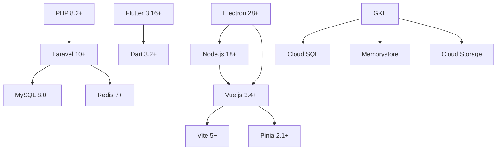

# Stack Tecnológica

Documentação detalhada de todas as tecnologias utilizadas no ecossistema VSmenu 2.0, incluindo versões, justificativas de escolha e melhores práticas.

## 🎯 Visão Geral

O VSmenu 2.0 utiliza uma stack moderna e escalável, focada em:
- **Performance**: Tecnologias otimizadas para alta performance
- **Produtividade**: Frameworks que aceleram o desenvolvimento
- **Escalabilidade**: Preparado para crescimento horizontal
- **Manutenibilidade**: Código limpo e bem estruturado
- **Ecossistema**: Comunidades ativas e suporte

### Stack por Aplicação

| Aplicação | Framework Principal | Database | State Management |
|-----------|-------------------|----------|------------------|
| **vsmenu-api** | Laravel 10+ (PHP 8.2+) | MySQL 8.0+ | Redis 7+ |
| **vsmenu-delivery-web** | Vue.js 3 + Vite | - | Pinia |
| **vsmenu-sales-panel** | Vue.js 3 + Vite | - | Pinia |
| **vsmenu-landing** | Nuxt.js 3 | - | - |
| **vsmenu-desktop** | Electron + Vue.js 3 | SQLite 3 | Pinia |
| **vsmenu-mobile-waiter** | Flutter 3.16+ | Hive | BLoC |
| **vsmenu-mobile-deliverer** | Flutter 3.16+ | Hive | BLoC |
| **vsmenu-digital-menu** | Vue.js 3 + Vite | - | Pinia |

## 🔧 Backend (vsmenu-api)

### Linguagem e Framework

#### PHP 8.2+

**Versão**: >= 8.2.0

**Justificativa**:
- **Named Arguments**: Melhora legibilidade
- **Enums**: Type safety nativo
- **Readonly Properties**: Imutabilidade
- **Performance**: JIT compiler melhorado
- **Union Types**: Tipagem mais forte

**Configurações Importantes**:
```ini
memory_limit = 256M
max_execution_time = 60
upload_max_filesize = 10M
post_max_size = 10M
opcache.enable = 1
opcache.memory_consumption = 128
```

**Referências**:
- [PHP 8.2 Release Notes](https://www.php.net/releases/8.2/en.php)
- [PHP Documentation](https://www.php.net/docs.php)

#### Laravel 10+

**Versão**: >= 10.0

**Justificativa**:
- **Produtividade**: Convenções e ferramentas prontas
- **Eloquent ORM**: Abstração poderosa de banco de dados
- **Ecosystem**: Pacotes e comunidade vasta
- **Queue System**: Fila robusta para jobs assíncronos
- **Broadcasting**: WebSocket nativo
- **Testing**: PHPUnit integrado

**Alternativas Consideradas**:
- **Symfony**: Mais modular, mas menos produtivo
- **Lumen**: Micro-framework, limitado para o escopo do projeto
- **Slim**: Muito minimalista, falta features

**Pacotes Principais**:
```json
{
  "laravel/framework": "^10.0",
  "laravel/sanctum": "^3.2",
  "laravel/horizon": "^5.15",
  "spatie/laravel-permission": "^5.10"
}
```

**Referências**:
- [Laravel Documentation](https://laravel.com/docs/10.x)
- [Laracasts](https://laracasts.com/)

### Banco de Dados

#### MySQL 8.0+

**Versão**: >= 8.0

**Justificativa**:
- **Maturidade**: Banco robusto e confiável
- **Performance**: Otimizações para transações ACID
- **JSON Support**: Queries nativas em JSON
- **Window Functions**: Queries analíticas avançadas
- **GCP Integration**: Cloud SQL suporta MySQL nativamente

**Configurações Importantes**:
```ini
innodb_buffer_pool_size = 1G
innodb_log_file_size = 256M
max_connections = 200
query_cache_type = 0
character_set_server = utf8mb4
collation_server = utf8mb4_unicode_ci
```

**Alternativas Consideradas**:
- **PostgreSQL**: Mais features, mas menos familiaridade da equipe
- **MariaDB**: Fork do MySQL, similar mas menos suporte no GCP

**Referências**:
- [MySQL Documentation](https://dev.mysql.com/doc/)
- [Cloud SQL for MySQL](https://cloud.google.com/sql/docs/mysql)

### Cache e Queue

#### Redis 7+

**Versão**: >= 7.0

**Justificativa**:
- **Performance**: Cache in-memory extremamente rápido
- **Versatilidade**: Cache, Queue, Pub/Sub
- **Data Structures**: Listas, Sets, Hashes, Sorted Sets
- **Persistence**: Snapshots e AOF
- **GCP Integration**: Memorystore for Redis

**Casos de Uso**:
- **Application Cache**: Cache de queries e dados computados
- **Session Storage**: Sessões distribuídas
- **Queue**: Laravel Queue com driver Redis
- **Pub/Sub**: Broadcasting de eventos

**Configurações Importantes**:
```conf
maxmemory 2gb
maxmemory-policy allkeys-lru
appendonly yes
appendfsync everysec
```

**Referências**:
- [Redis Documentation](https://redis.io/documentation)
- [Laravel Queue](https://laravel.com/docs/queues)

### Autenticação

#### Laravel Sanctum

**Versão**: >= 3.2

**Justificativa**:
- **Simplicidade**: Fácil implementação de API tokens
- **Stateless**: Tokens sem necessidade de sessão
- **Multi-device**: Múltiplos tokens por usuário
- **Revogação**: Controle granular de tokens
- **SPA Support**: Suporte nativo para SPAs

**Alternativas Consideradas**:
- **Laravel Passport**: OAuth2 completo, muito complexo para o projeto
- **JWT**: Requer implementação manual, Sanctum já resolve

**Exemplo de Uso**:
```php
// Geração de token
$token = $user->createToken('api-token')->plainTextToken;

// Autenticação
Route::middleware('auth:sanctum')->get('/user', ...);
```

**Referências**:
- [Laravel Sanctum Documentation](https://laravel.com/docs/sanctum)

### API e Broadcasting

#### REST API

**Formato**: JSON
**Versionamento**: `/api/v1/`, `/api/v2/`
**Status Codes**: HTTP padrão (200, 201, 400, 401, 403, 404, 500)

#### Laravel Broadcasting (WebSocket)

**Versão**: Laravel 10+ Broadcasting

**Driver**: Pusher ou Soketi (self-hosted)

**Justificativa**:
- **Real-time**: Eventos em tempo real
- **Channels**: Privados, presenciais, públicos
- **Integration**: Integração nativa com Laravel

**Casos de Uso**:
- Notificação de novos pedidos
- Atualização de status de mesa
- Chat de suporte
- Sincronização multi-dispositivo

**Referências**:
- [Laravel Broadcasting](https://laravel.com/docs/broadcasting)

### Testes

#### PHPUnit

**Versão**: >= 10.0

**Tipos de Testes**:
- **Unit Tests**: Lógica isolada
- **Feature Tests**: Endpoints de API
- **Integration Tests**: Database, Cache, Queue

**Exemplo**:
```php
public function test_create_order(): void
{
    $response = $this->postJson('/api/v1/orders', [
        'customer_id' => 1,
        'items' => [...]
    ]);

    $response->assertStatus(201)
             ->assertJsonStructure(['data' => ['id', 'total']]);
}
```

**Referências**:
- [PHPUnit Documentation](https://phpunit.de/documentation.html)
- [Laravel Testing](https://laravel.com/docs/testing)

## 🎨 Frontend Web

### Framework

#### Vue.js 3.x

**Versão**: >= 3.4

**Justificativa**:
- **Composition API**: Melhor reutilização de lógica
- **Reatividade**: Sistema reativo poderoso
- **Performance**: Virtual DOM otimizado
- **TypeScript**: Suporte first-class (futuro)
- **Ecosystem**: Ecossistema rico (Router, Pinia, Vite)

**Alternativas Consideradas**:
- **React**: Mais popular, mas curva de aprendizado maior
- **Angular**: Muito "opinionated", pesado para o projeto
- **Svelte**: Menos maduro, comunidade menor

**Exemplo de Uso (Composition API)**:
```vue
<script setup>
import { ref, computed } from 'vue'

const count = ref(0)
const doubled = computed(() => count.value * 2)

function increment() {
  count.value++
}
</script>

<template>
  <button @click="increment">Count: {{ count }}</button>
</template>
```

**Referências**:
- [Vue.js Documentation](https://vuejs.org/)
- [Vue Mastery](https://www.vuemastery.com/)

### Build Tool

#### Vite

**Versão**: >= 5.0

**Justificativa**:
- **Performance**: HMR instantâneo
- **ESM Native**: Usa ES modules nativamente
- **Build Speed**: Build de produção rápido
- **Plugin Ecosystem**: Plugins para Vue, TypeScript, etc.

**Alternativas Consideradas**:
- **Webpack**: Mais lento, mais complexo
- **Parcel**: Menos features, menos controle

**Configuração**:
```javascript
// vite.config.js
export default {
  plugins: [vue()],
  server: {
    port: 3000
  },
  build: {
    target: 'esnext',
    minify: 'terser'
  }
}
```

**Referências**:
- [Vite Documentation](https://vitejs.dev/)

### State Management

#### Pinia

**Versão**: >= 2.1

**Justificativa**:
- **TypeScript**: Inferência de tipos automática
- **Simplicidade**: API mais simples que Vuex
- **Devtools**: Suporte completo ao Vue Devtools
- **Composition API**: Integração perfeita
- **Modularidade**: Stores independentes

**Alternativas Consideradas**:
- **Vuex**: Predecessor do Pinia, mais verboso
- **Global Refs**: Não escala bem

**Exemplo de Store**:
```javascript
import { defineStore } from 'pinia'

export const useOrderStore = defineStore('orders', {
  state: () => ({
    orders: []
  }),
  
  getters: {
    totalOrders: (state) => state.orders.length
  },
  
  actions: {
    async fetchOrders() {
      this.orders = await api.getOrders()
    }
  }
})
```

**Referências**:
- [Pinia Documentation](https://pinia.vuejs.org/)

### Router

#### Vue Router 4+

**Versão**: >= 4.2

**Features**:
- **Dynamic Routing**: Rotas dinâmicas
- **Navigation Guards**: Proteção de rotas
- **Lazy Loading**: Code splitting automático
- **History Mode**: Suporte a HTML5 History API

**Exemplo**:
```javascript
import { createRouter, createWebHistory } from 'vue-router'

const router = createRouter({
  history: createWebHistory(),
  routes: [
    {
      path: '/orders',
      component: () => import('@/views/Orders.vue'),
      meta: { requiresAuth: true }
    }
  ]
})
```

**Referências**:
- [Vue Router Documentation](https://router.vuejs.org/)

### HTTP Client

#### Axios

**Versão**: >= 1.6

**Justificativa**:
- **Interceptors**: Modificação de requests/responses
- **Promise-based**: Async/await suportado
- **Browser + Node**: Funciona em ambos ambientes
- **Cancel Requests**: Cancelamento de requests

**Configuração**:
```javascript
import axios from 'axios'

const api = axios.create({
  baseURL: import.meta.env.VITE_API_URL,
  timeout: 10000,
  headers: {
    'Content-Type': 'application/json'
  }
})

// Interceptor para adicionar token
api.interceptors.request.use(config => {
  const token = localStorage.getItem('token')
  if (token) {
    config.headers.Authorization = `Bearer ${token}`
  }
  return config
})
```

**Referências**:
- [Axios Documentation](https://axios-http.com/)

### UI e Estilo

#### TailwindCSS

**Versão**: >= 3.4

**Justificativa**:
- **Utility-first**: Classes utilitárias reutilizáveis
- **Customização**: Totalmente customizável
- **Performance**: PurgeCSS integrado
- **Responsive**: Mobile-first

**Configuração**:
```javascript
// tailwind.config.js
export default {
  content: ['./index.html', './src/**/*.{vue,js,ts}'],
  theme: {
    extend: {
      colors: {
        primary: '#FF6B35',
        secondary: '#004E89'
      }
    }
  }
}
```

**Referências**:
- [TailwindCSS Documentation](https://tailwindcss.com/)

### Landing Page Específico

#### Nuxt.js 3

**Versão**: >= 3.10

**Justificativa** (apenas para vsmenu-landing):
- **SSR**: Server-Side Rendering para SEO
- **SSG**: Static Site Generation
- **File-based Routing**: Rotas automáticas
- **SEO**: Meta tags e sitemap automáticos

**Referências**:
- [Nuxt.js Documentation](https://nuxt.com/)

## 🖥️ Desktop (vsmenu-desktop)

### Framework

#### Electron

**Versão**: >= 28.0

**Justificativa**:
- **Cross-platform**: Windows, macOS, Linux
- **Web Technologies**: Reutilização de Vue.js
- **Native APIs**: Acesso ao sistema operacional
- **Auto-update**: Atualização automática
- **Offline-first**: Funcionamento offline completo

**Alternativas Consideradas**:
- **Tauri**: Mais leve, mas menos maduro
- **NW.js**: Similar ao Electron, menos popular

**Estrutura**:
- **Main Process**: Node.js com acesso ao sistema
- **Renderer Process**: Chromium + Vue.js

**Exemplo de IPC**:
```javascript
// Main Process
ipcMain.handle('get-orders', async () => {
  return await db.query('SELECT * FROM orders')
})

// Renderer Process
const orders = await ipcRenderer.invoke('get-orders')
```

**Referências**:
- [Electron Documentation](https://www.electronjs.org/docs)

### Database Local

#### SQLite 3

**Versão**: >= 3.40

**Justificativa**:
- **Serverless**: Não requer servidor de banco
- **Lightweight**: Pequeno footprint
- **ACID**: Transações confiáveis
- **Cross-platform**: Funciona em todos OS
- **Performance**: Rápido para operações locais

**Biblioteca**: `better-sqlite3`

**Exemplo**:
```javascript
const Database = require('better-sqlite3')
const db = new Database('vsmenu.db')

const insert = db.prepare('INSERT INTO orders (customer, total) VALUES (?, ?)')
insert.run('João Silva', 150.00)
```

**Referências**:
- [SQLite Documentation](https://www.sqlite.org/docs.html)
- [better-sqlite3](https://github.com/WiseLibs/better-sqlite3)

### Build e Packaging

#### Electron Builder

**Versão**: >= 24.0

**Features**:
- **Instaladores**: .exe, .dmg, .AppImage, .deb
- **Code Signing**: Assinatura de código
- **Auto-update**: Atualização automática
- **Multi-platform**: Build para múltiplos OS

**Referências**:
- [Electron Builder Documentation](https://www.electron.build/)

## 📱 Mobile (Flutter)

### Framework

#### Flutter 3.16+

**Versão**: >= 3.16.0

**Justificativa**:
- **Cross-platform**: iOS e Android com um código
- **Performance**: Compilado para nativo
- **Hot Reload**: Desenvolvimento rápido
- **Rich Widgets**: UI components ricos
- **Material Design**: Design system nativo

**Alternativas Consideradas**:
- **React Native**: Menos performático, mais dependente de bridges
- **Ionic**: Híbrido, performance inferior
- **Native**: Requer 2 codebases (iOS + Android)

**Configuração**:
```yaml
# pubspec.yaml
name: vsmenu_mobile_waiter
description: VSmenu Mobile App para Garçons

environment:
  sdk: '>=3.2.0 <4.0.0'

dependencies:
  flutter:
    sdk: flutter
  flutter_bloc: ^8.1.3
  dio: ^5.4.0
  hive: ^2.2.3
  get_it: ^7.6.4
```

**Referências**:
- [Flutter Documentation](https://docs.flutter.dev/)

### State Management

#### BLoC Pattern

**Versão**: flutter_bloc >= 8.1.3

**Justificativa**:
- **Separation of Concerns**: UI separada da lógica
- **Testable**: Fácil de testar
- **Predictable**: Fluxo de dados previsível
- **Reusable**: Lógica reutilizável

**Estrutura**:
```dart
// Event
abstract class OrderEvent {}
class FetchOrders extends OrderEvent {}

// State
abstract class OrderState {}
class OrderLoading extends OrderState {}
class OrderLoaded extends OrderState {
  final List<Order> orders;
  OrderLoaded(this.orders);
}

// Bloc
class OrderBloc extends Bloc<OrderEvent, OrderState> {
  OrderBloc() : super(OrderLoading()) {
    on<FetchOrders>(_onFetchOrders);
  }
  
  Future<void> _onFetchOrders(
    FetchOrders event,
    Emitter<OrderState> emit,
  ) async {
    final orders = await repository.getOrders();
    emit(OrderLoaded(orders));
  }
}
```

**Alternativas Consideradas**:
- **Provider**: Mais simples, mas menos escalável
- **Riverpod**: Moderno, mas menos documentação
- **GetX**: Tudo em um, mas muito "mágico"

**Referências**:
- [BLoC Library](https://bloclibrary.dev/)

### HTTP Client

#### Dio

**Versão**: >= 5.4.0

**Justificativa**:
- **Interceptors**: Modificação de requests
- **FormData**: Upload de arquivos
- **Cancel Requests**: Cancelamento de requests
- **Retry Logic**: Retry automático

**Referências**:
- [Dio Documentation](https://pub.dev/packages/dio)

### Local Storage

#### Hive

**Versão**: >= 2.2.3

**Justificativa**:
- **NoSQL**: Key-value store rápido
- **Type Safety**: Type adapters
- **Encryption**: Suporte a criptografia
- **Performance**: Mais rápido que SQLite para key-value

**Referências**:
- [Hive Documentation](https://docs.hivedb.dev/)

### Dependency Injection

#### GetIt

**Versão**: >= 7.6.4

**Justificativa**:
- **Simple**: API simples
- **Fast**: Service locator rápido
- **Flexible**: Singleton, Factory, Lazy

**Referências**:
- [GetIt Documentation](https://pub.dev/packages/get_it)

## ☁️ Infraestrutura (GCP)

### Cloud Provider

#### Google Cloud Platform (GCP)

**Justificativa**:
- **Kubernetes**: GKE gerenciado
- **Database**: Cloud SQL com MySQL
- **Cache**: Memorystore for Redis
- **Storage**: Cloud Storage escalável
- **CDN**: Cloud CDN global
- **Pricing**: Competitivo com bom custo-benefício

**Alternativas Consideradas**:
- **AWS**: Mais serviços, mas mais complexo e caro
- **Azure**: Bom para .NET, menos adequado para nossa stack
- **DigitalOcean**: Mais simples, mas menos features

### Container Orchestration

#### Google Kubernetes Engine (GKE)

**Versão**: GKE 1.28+ (Autopilot ou Standard)

**Justificativa**:
- **Managed**: Kubernetes gerenciado
- **Auto-scaling**: Escala automática
- **High Availability**: Multi-zone deployment
- **Integration**: Integração com outros serviços GCP

**Configuração**:
```yaml
apiVersion: apps/v1
kind: Deployment
metadata:
  name: vsmenu-api
spec:
  replicas: 3
  selector:
    matchLabels:
      app: vsmenu-api
  template:
    metadata:
      labels:
        app: vsmenu-api
    spec:
      containers:
      - name: api
        image: gcr.io/vsmenu/api:latest
        ports:
        - containerPort: 8000
```

**Referências**:
- [GKE Documentation](https://cloud.google.com/kubernetes-engine/docs)

### Database

#### Cloud SQL for MySQL

**Configuração**:
- **Tier**: db-n1-standard-2 (production)
- **Storage**: 100GB SSD
- **Backups**: Diários automáticos
- **HA**: High Availability habilitado

**Referências**:
- [Cloud SQL Documentation](https://cloud.google.com/sql/docs)

### Cache/Queue

#### Memorystore for Redis

**Configuração**:
- **Tier**: Standard (HA habilitado)
- **Memory**: 5GB
- **Version**: Redis 7.x

**Referências**:
- [Memorystore Documentation](https://cloud.google.com/memorystore/docs)

### Storage

#### Cloud Storage

**Buckets**:
- `vsmenu-uploads`: Uploads de usuários
- `vsmenu-assets`: Assets estáticos
- `vsmenu-backups`: Backups de banco

**Configuração**:
- **Lifecycle**: Policies de lifecycle
- **CDN**: Cloud CDN habilitado
- **Versioning**: Habilitado para uploads

**Referências**:
- [Cloud Storage Documentation](https://cloud.google.com/storage/docs)

### CI/CD

#### GitHub Actions

**Justificativa**:
- **Integration**: Integrado ao GitHub
- **Free**: Tier gratuito generoso
- **Marketplace**: Actions prontas
- **Flexibility**: YAML configurável

**Workflow Exemplo**:
```yaml
name: Deploy API

on:
  push:
    branches: [main]

jobs:
  deploy:
    runs-on: ubuntu-latest
    steps:
      - uses: actions/checkout@v3
      
      - name: Build Docker Image
        run: docker build -t gcr.io/vsmenu/api:${{ github.sha }} .
      
      - name: Push to GCR
        run: docker push gcr.io/vsmenu/api:${{ github.sha }}
      
      - name: Deploy to GKE
        run: kubectl set image deployment/vsmenu-api api=gcr.io/vsmenu/api:${{ github.sha }}
```

**Referências**:
- [GitHub Actions Documentation](https://docs.github.com/en/actions)

### Monitoring

#### Cloud Monitoring + Sentry (opcional)

**Cloud Monitoring**:
- Métricas de infraestrutura
- Logs de aplicação
- Alertas configuráveis

**Sentry** (opcional para erro tracking):
- Error tracking
- Performance monitoring
- Release tracking

**Referências**:
- [Cloud Monitoring](https://cloud.google.com/monitoring/docs)
- [Sentry Documentation](https://docs.sentry.io/)

## 🛠️ Ferramentas de Desenvolvimento

### Version Control

#### Git

**Versão**: >= 2.40

**Convenções**:
- **Commits**: Conventional Commits
- **Branches**: `feature/`, `fix/`, `docs/`, `refactor/`
- **Pull Requests**: Descrição clara, review obrigatório

### Package Managers

#### Composer (Backend)

**Versão**: >= 2.6

**Configuração**:
```json
{
  "require": {
    "php": "^8.2",
    "laravel/framework": "^10.0"
  },
  "require-dev": {
    "phpunit/phpunit": "^10.0"
  }
}
```

#### npm/yarn (Frontend)

**Versão**: npm >= 10.0 ou yarn >= 4.0

**Configuração**:
```json
{
  "dependencies": {
    "vue": "^3.4.0",
    "pinia": "^2.1.0"
  },
  "devDependencies": {
    "vite": "^5.0.0",
    "vitest": "^1.0.0"
  }
}
```

#### pub (Mobile)

**Versão**: Incluído com Flutter SDK

### Docker

#### Docker & Docker Compose

**Versão**: Docker >= 24.0, Compose >= 2.20

**Justificativa**:
- **Consistency**: Ambiente consistente entre dev e prod
- **Isolation**: Isolamento de dependências
- **Portability**: Fácil compartilhamento

**docker-compose.yml Exemplo**:
```yaml
version: '3.8'

services:
  api:
    build: ./vsmenu-api
    ports:
      - "8000:8000"
    environment:
      DB_HOST: mysql
      REDIS_HOST: redis
    depends_on:
      - mysql
      - redis

  mysql:
    image: mysql:8.0
    environment:
      MYSQL_DATABASE: vsmenu
      MYSQL_ROOT_PASSWORD: secret

  redis:
    image: redis:7-alpine
```

**Referências**:
- [Docker Documentation](https://docs.docker.com/)

### IDEs Recomendados

- **Backend**: PHPStorm, VS Code + PHP Intelephense
- **Frontend**: VS Code + Volar
- **Mobile**: VS Code + Flutter extension, Android Studio
- **Desktop**: VS Code

## 📊 Matriz de Compatibilidade

| Tecnologia | Versão Mínima | Versão Recomendada | Compatibilidade |
|------------|---------------|-------------------|-----------------|
| **PHP** | 8.2.0 | 8.3.x | ✅ Laravel 10+ |
| **Laravel** | 10.0 | 10.48.x | ✅ PHP 8.2+ |
| **MySQL** | 8.0 | 8.0.35 | ✅ Laravel 10+ |
| **Redis** | 7.0 | 7.2.x | ✅ Laravel 10+ |
| **Node.js** | 18.0 | 20.x LTS | ✅ Vite 5+ |
| **Vue.js** | 3.4.0 | 3.4.x | ✅ Vite 5+ |
| **Vite** | 5.0 | 5.0.x | ✅ Vue 3.4+ |
| **Pinia** | 2.1 | 2.1.x | ✅ Vue 3.4+ |
| **Electron** | 28.0 | 28.x | ✅ Node 18+ |
| **Flutter** | 3.16.0 | 3.19.x | ✅ Dart 3.2+ |
| **Docker** | 24.0 | 25.x | ✅ Compose 2.20+ |

### Dependências Críticas



## 🗓️ Roadmap de Atualizações

### 2025 Q1

- ✅ **PHP 8.2**: Migração concluída
- ✅ **Laravel 10**: Upgrade completo
- ✅ **Vue 3.4**: Composition API em todos projetos
- ⏳ **Flutter 3.19**: Atualização planejada
- ⏳ **TypeScript**: Migração gradual do frontend

### 2025 Q2

- 📅 **Laravel 11**: Upgrade quando estável
- 📅 **PHP 8.3**: Migração para features mais recentes
- 📅 **Vite 6**: Upgrade quando disponível
- 📅 **TypeScript 100%**: Migração completa do frontend

### 2025 Q3

- 📅 **Flutter 4.0**: Upgrade quando lançado
- 📅 **Electron 30+**: Atualização contínua
- 📅 **GKE Autopilot**: Migração de Standard para Autopilot

### 2025 Q4

- 📅 **Performance Audit**: Auditoria completa de performance
- 📅 **Security Audit**: Auditoria de segurança
- 📅 **Dependency Update**: Atualização geral de dependências

### Política de Atualização

- **Segurança**: Patches de segurança aplicados imediatamente
- **Minor Versions**: Atualizadas mensalmente
- **Major Versions**: Planejadas e testadas em ambiente de staging
- **LTS**: Preferência por versões LTS quando disponível

## 📚 Referências Consolidadas

### Documentação Oficial

- [PHP](https://www.php.net/docs.php)
- [Laravel](https://laravel.com/docs)
- [Vue.js](https://vuejs.org/)
- [Flutter](https://docs.flutter.dev/)
- [Electron](https://www.electronjs.org/docs)
- [Google Cloud Platform](https://cloud.google.com/docs)

### Comunidades e Recursos

- [Laracasts](https://laracasts.com/) - Laravel screencasts
- [Vue Mastery](https://www.vuemastery.com/) - Vue.js courses
- [Flutter Community](https://flutter.dev/community)
- [Stack Overflow](https://stackoverflow.com/)
- [GitHub Discussions](https://github.com/orgs/vsmenu/discussions)

### Blogs e Newsletters

- [Laravel News](https://laravel-news.com/)
- [Vue.js News](https://news.vuejs.org/)
- [Flutter Awesome](https://flutterawesome.com/)
- [Google Cloud Blog](https://cloud.google.com/blog)

---

**Última Atualização**: Dezembro 2025  
**Responsável**: Equipe de Arquitetura VSmenu  
**Revisão**: Trimestral

[⬅️ Voltar para Arquitetura](./index.md)
